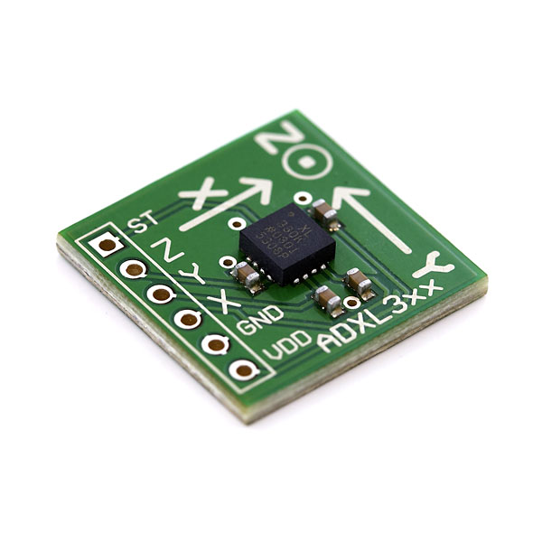

# ADXL330

- Classificação: acelerômetro
- Nome técnico: ADXL330 

O sensor ADXL330 é um acelerômetro de três eixos, pequeno, fino e de baixo custo energético. Ele mede a aceleração estática da grávidade em aplicações sensíveis a inclinação e também a aceleração dinâmica que resulta de movimento, choque ou vibração. Pode ser aplicado em sistemas de videogame, dispositivos mobile, estabilização de imagens e dispositivos de esporte e saúde.

## Características

### Sensibilidade

Nos eixos X, Y e Z: 300 mV/g

Mudança devido a temperatura: ±0.015 %/°C

### Faixa

±3.6g

### Precisão

10%

### Exatidão

Informação não encontrada.

### Resolução

Informação não encontrada.

### Offset

Voltagem 0g nos eixos X, Y e Z: 1.5V

Erro de offset 0g em relação à temperatura: ±1mg/°C

### Linearidade

Erro de linearidade: ±0.3% 

### Histerese

Muito baixa: menor que 3mg (Dentro da faixa de temperatura -25°C e 70°C).

### Tempos de resposta

Informação não encontrada.

### Linearidade dinâmica

Informação não encontrada.

## Fotos

## Referências

[Datasheet] https://www.analog.com/media/en/technical-documentation/data-sheets/ADXL330.pdf
[Artigo] https://arxiv.org/ftp/arxiv/papers/1309/1309.2090.pdf
