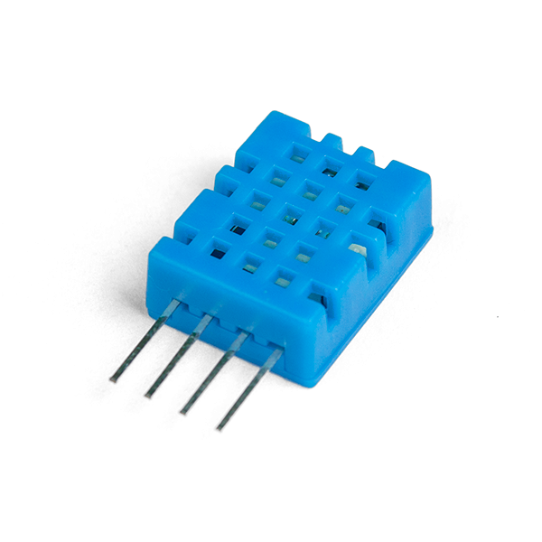
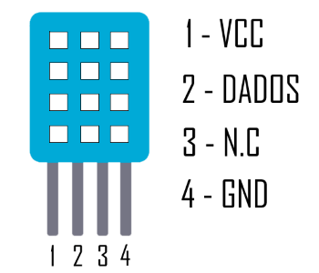
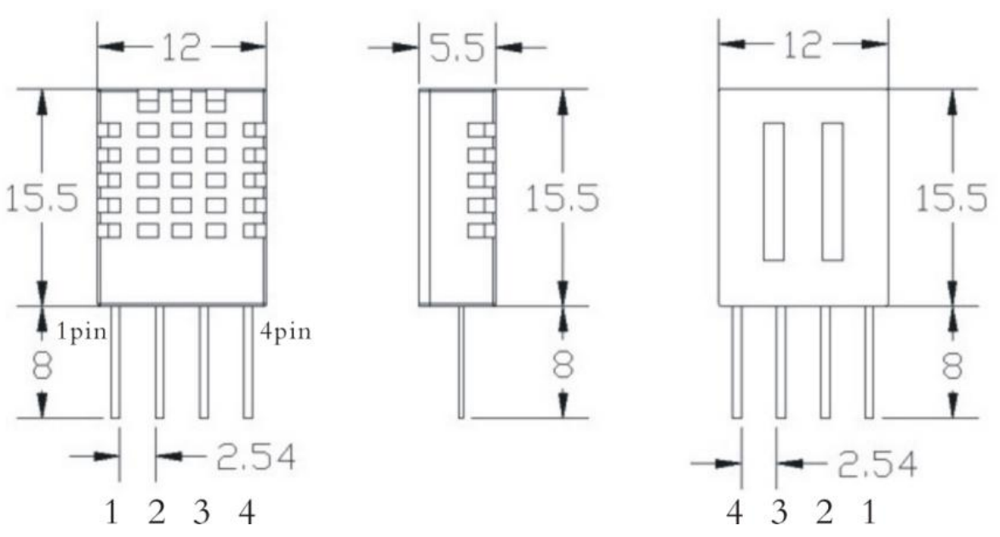

# DHT11

- Classificação: temperatura, umidade
- Nome técnico: DHT11

O sensor DHT11 é um sensor digital composto, capaz de medir a temperatura (ºC) e a umidade relativa (UR) do ar. Os dados são transmitidos em um único pino, com um sinal digital serial. O sensor apresenta quatro pinos: um pino para alimentação (Vcc); um pino de dados; um pino não utilizado e um pino terra (GND).

## Características

### Sensibilidade

Temperatura: 1ºC

Umidade: 1%UR

### Faixa

Temperatura: 0 a 50ºC

Umidade: 20 a 90%UR

### Precisão (Repeatability)

Temperatura: ±1ºC

Umidade: ±1%UR

### Exatidão (Accuracy)

Temperatura: ±2ºC

Umidade: ±5%UR

### Resolução

Temperatura: 1ºC

Umidade: 1%UR

### Offset

Temperatura: N/A

Umidade: N/A

### Linearidade

Temperatura: N/A

Umidade: N/A

### Histerese

Temperatura: N/A

Umidade: ±1%UR

### Tempos de resposta

Temperatura: 6 a 30s

Umidade: 6 a 15s

### Linearidade dinâmica

Temperatura: N/A

Umidade: N/A

## Fotos

## Referências

[Datasheet Aosong Electronics]( https://s3-sa-east-1.amazonaws.com/robocore-lojavirtual/791/Datasheet_DHT11.pdf)

[Datasheet OSEPP Electronics](https://www.mouser.com/datasheet/2/758/DHT11-Technical-Data-Sheet-Translated-Version-1143054.pdf)

[Filipeflop.com](https://www.filipeflop.com/produto/sensor-de-umidade-e-temperatura-dht11/)

[Robocore.net]( https://www.robocore.net/loja/sensores/sensor-de-temperatura-dht11)

