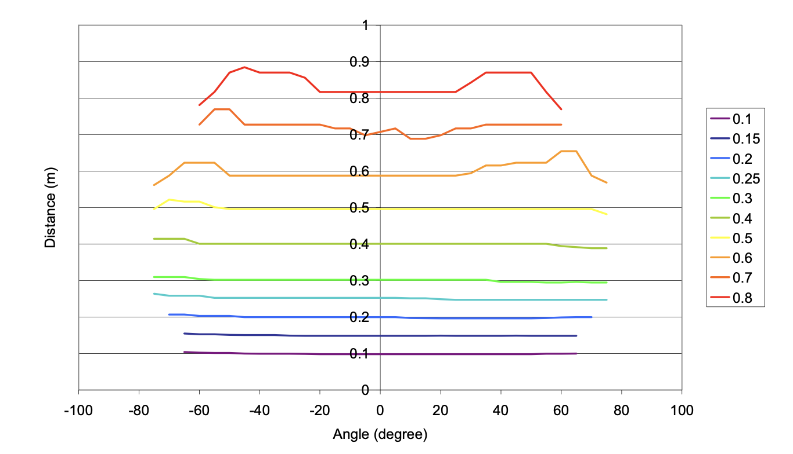
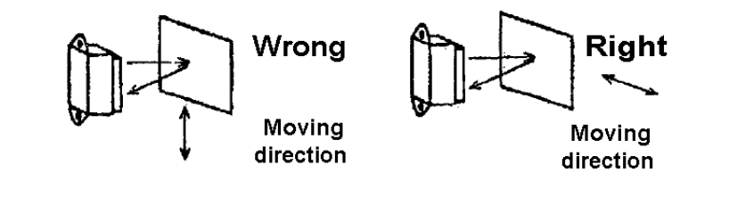
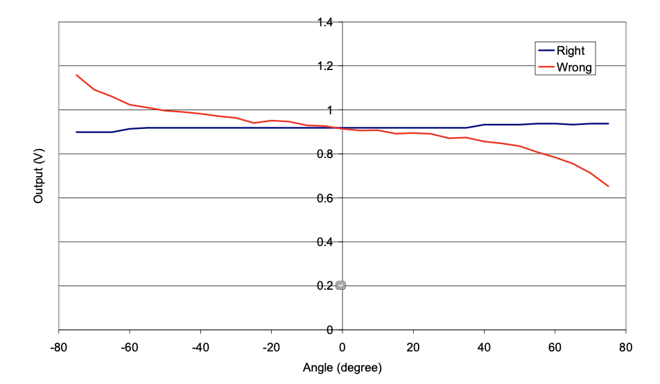
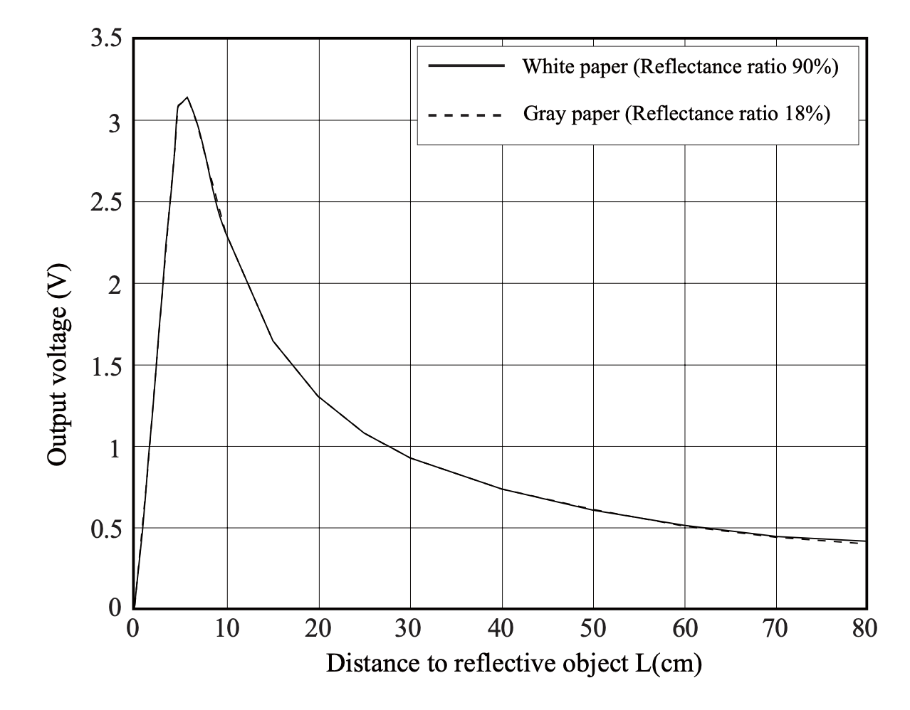
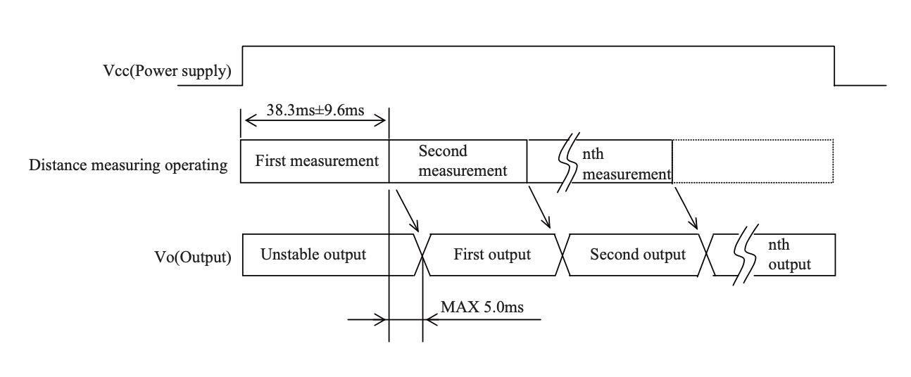
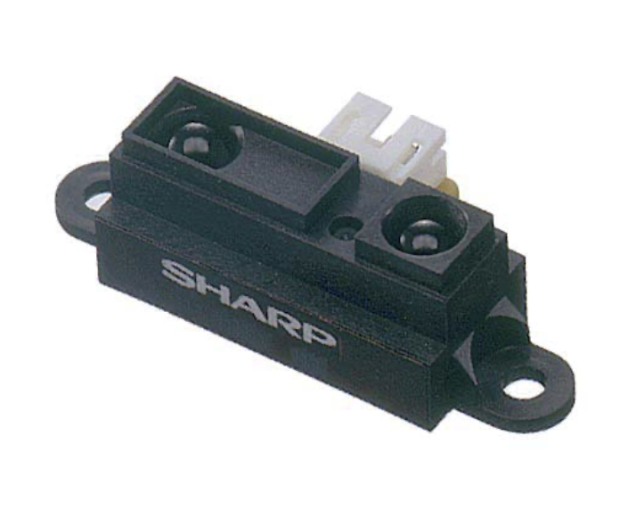

# GP2Y0A21YK0F

- Classificação: Sensor de medição de distância
- Nome técnico: Sharp GP2Y0A21YK0F

O GP2Y0A21YK0F é um sensor de medição de distância, composto por um detector sensível à posição, um diodo de luz infravermelha e um circuito de processamento de sinal.
A variedade da reflexividade do objeto, a temperatura do ambiente e o tempo de uso não influenciam facilmente a detecção da distância devido à adoção do método de triangulação.
Este dispositivo varia a tensão de saída em função a distância de detecção. Este sensor também pode ser usado como um sensor de proximidade.

## Características

- Faixa de medição de distância: 10 até 80 cm
- Tipo de saída: Analógica
- Tamanho: 29,5 × 13 × 13,5 mm
- Corrente: Tipicamente 30 mA
- Tensão de alimentação: 4,5 até 5,5 V
- Temperatura de Operação: -10 até +60 °C
- Temperatura de Armazenagem: -40 até +70 °C 

### Sensibilidade

Como o sensor e análogo, não há uma sensibilidade especificada. 

Como o sensor e análogo, não há uma sensibilidade especificada. 

Como o sensor e análogo, não há uma sensibilidade especificada. 

### Faixa

A faixa do sensor especificada é de 10 cm até 80 cm, porem segundo Malheiros et. al. o sensor demonstra usabilidade a partir de 8 cm.

A faixa do sensor especificada é de 10 cm até 80 cm, porem segundo Malheiros et. al. o sensor demonstra usabilidade a partir de 8 cm.

A faixa do sensor especificada é de 10 cm até 80 cm, porem segundo Malheiros et. al. o sensor demonstra usabilidade a partir de 8 cm.

### Precisão

Segundo Malheiros et al. o sensor demonstra um desvio padrão na tensão de saída de 0,030 mV, indiferentemente da distância do objeto. A tensão de saída varia entre 3 V para 8 cm e 0,4 V para 80 cm. Dado uma precisão de 99,9% (sendo 3,09 desvios) a precisão varia entre +/- 0,25 cm para 8 cm e +/- 18,54 cm para 80 cm.

Segundo Malheiros et al. o sensor demonstra um desvio padrão na tensão de saída de 0,030 mV, indiferentemente da distância do objeto. A tensão de saída varia entre 3 V para 8 cm e 0,4 V para 80 cm. Dado uma precisão de 99,9% (sendo 3,09 desvios) a precisão varia entre +/- 0,25 cm para 8 cm e +/- 18,54 cm para 80 cm.

Segundo Malheiros et al. o sensor demonstra um desvio padrão na tensão de saída de 0,030 mV, indiferentemente da distância do objeto. A tensão de saída varia entre 3 V para 8 cm e 0,4 V para 80 cm. Dado uma precisão de 99,9% (sendo 3,09 desvios) a precisão varia entre +/- 0,25 cm para 8 cm e +/- 18,54 cm para 80 cm.

### Exatidão

A exatidão da medição varia em função de dois fatores: O ângulo da superfície e a direção de movimento do objeto.

Dependendo do ângulo e da distância da superfície a exatidão da medição varia conforme a imagem embaixo.

Além disso existe uma dependência entre a direção de movimento do objeto e da posição do sensor, ilustrado na seguinte imagem.

O posicionamento do sensor diretamente influencia a exatidão, especialmente se ha um ângulo entre a superfície e o sensor.

A exatidão da medição varia em função de dois fatores: O ângulo da superfície e a direção de movimento do objeto.

Dependendo do ângulo e da distância da superfície a exatidão da medição varia conforme a imagem embaixo.

Além disso existe uma dependência entre a direção de movimento do objeto e da posição do sensor, ilustrado na seguinte imagem.

O posicionamento do sensor diretamente influencia a exatidão, especialmente se ha um ângulo entre a superfície e o sensor.

A exatidão da medição varia em função de dois fatores: O ângulo da superfície e a direção de movimento do objeto.

Dependendo do ângulo e da distância da superfície a exatidão da medição varia conforme a imagem embaixo.

Além disso existe uma dependência entre a direção de movimento do objeto e da posição do sensor, ilustrado na seguinte imagem.

O posicionamento do sensor diretamente influencia a exatidão, especialmente se ha um ângulo entre a superfície e o sensor.

### Resolução

Como o sensor não tem saída digital, não há uma resolução específica.

Como o sensor não tem saída digital, não há uma resolução específica.

Como o sensor não tem saída digital, não há uma resolução específica.

### Offset

O offset da tensão de saída é de 0,4 V para 80 cm. A largura da faixa de tensão de saída varia entre 1,65 V e 2,15 V.

O offset da tensão de saída é de 0,4 V para 80 cm. A largura da faixa de tensão de saída varia entre 1,65 V e 2,15 V.

O offset da tensão de saída é de 0,4 V para 80 cm. A largura da faixa de tensão de saída varia entre 1,65 V e 2,15 V.

### Linearidade

O sensor tem um comportamento altamente não linear. 

### Histerese

Não há uma histerese especificada para o sensor GP2Y0A21YK0F.

### Tempos de resposta

Segundo o Datasheet do ano 2005 o sensor tem um tempo de resposta de 39 ms. Além disso o sensor requer um 
tempo de inicialização de 44 ms.

### Linearidade dinâmica

O sensor tem um comportamento altamente não linear. 

## Fotos

## Referências

[GP2Y0A21YK0F Datasheet from Sharp](https://global.sharp/products/device/lineup/data/pdf/datasheet/gp2y0a21yk_e.pdf)

[GP2Y0A21YK0F Datasheet from Python Exemplary, 2005](http://www.python-exemplary.com/download/GP2Y0A21YK.pdf)

[GP2Y0A21YK0F Datasheet from Solar Robotics, Novembro 2011](https://solarbotics.com/wp-content/uploads/airrs-manual-35238-nov-7-2011.pdf)

[Malheiros, P., Gonc¸alves, J., and Costa, P. (2009). Towards a more Accurate Infrared Distance Sensor Model. In International Symposium on Computational Intelligence for Engineering Systems., Porto](https://pdfs.semanticscholar.org/8d5d/4d42800577d6fba17208f31046f39feaff30.pdf)
