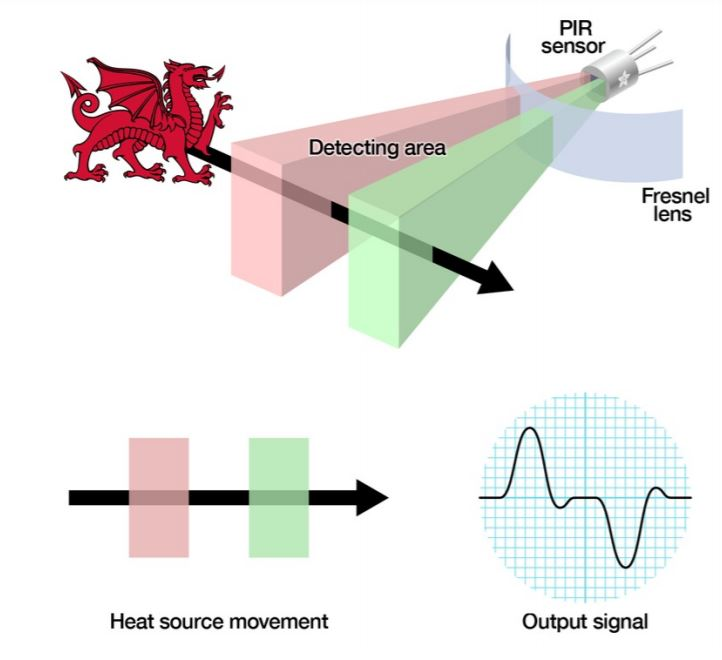
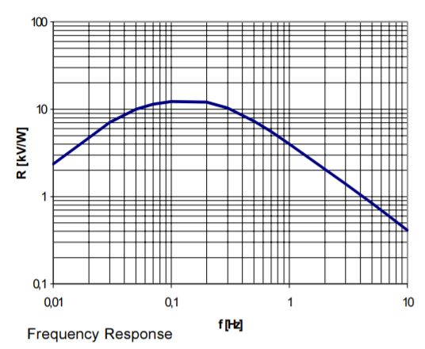

# Sensor de Presença PIR HC-SR501

- Classificação: Presença, proximidade.
- Nome técnico: PIR HC-SR501.

Este módulo, utiliza um sensor PIR (piroelétrico) no qual pode ser usado como uma ferramenta importante para segurança de propriedades (como casas, lojas, apartamentos), acionando alarmes ou lampadas ao identificar alguma presença. Alem de poder ser usado como forma de segurança, é possível utilizar o sensor como economia de energia, sendo possível usar-lo em conjunto com um microcontrolador e sensor LDR, controlando sistemas de iluminações somente quando o ambiente estiver escuro.

O sensor PIR é capaz de detectar a variação de luz infravermelha emitida pela radiação de algum corpo emissor.

## Características

### Sensibilidade

O sensor PIR possui dois slots nele, no qual cada slot é feito de um material especial que é sensível a uma variação infravermelho. Os dois slots podem chegar até alguma distância (que é a faixa de distância alcançada pelo sensor). Quando o sensor está ocioso, ambos os slots detectam a mesma quantidade de radição infravermelho. Quando um corpo radiante de infravermelhor passa na faixa desses slots, primeiramente o primeiro slot é interceptado, que causa um diferencial positivo entre as duas metades no sensor. Quando o mesmo corpo passa pelo outro slot, o contrário acontece, o sensor gera uma mudança diferencial negativa. Assim construindo um sinal conforme a figura a seguir:

Com isso, o módulo do sensor contem um CI BISS0001 no qual recebe essa frequência gerada pelo sensor e interpreta gerando uma saída binária (0 ou 1). O valor tipico conforme datasheet do CI para detecção é de 16KHz.

O sensor é capaz de identificar presença de 3m até 7m de alcance (valores configuraveis por um potenciômetro) com 100º/110º de ângulo.

No módulo do sensor, contem um potênciometro no qual é responsável por ajustar a sensibilidade com o range de 3m (potenciômetro totalmente fechado, sentido horário) e 7m (potenciômetro totalmente aberto, sentido anti-horário). Esses valores são controlados pelo CI BISS0001 e não foi encontrado em nenhum site os valores minimos e máximos para chegar nessas distâncias de detecção.

### Faixa

0m até 7m.

### Precisão

N/A.

### Exatidão

N/A

### Resolução

10kV/W, conforme a figura a seguir:

### Offset

minimo de 0.2V na saída do sensor.

### Linearidade

N/A

### Histerese

N/A

### Tempos de resposta

0.1Hz, conforme a figura a seguir:

### Linearidade dinâmica

N/A

## Fotos

## Referências

Foram encontrados datasheets de diferentes autores mostrando o mesmo sensor:

[Mpja](https://www.mpja.com/download/31227sc.pdf)

[Epitran](https://www.epitran.it/ebayDrive/datasheet/44.pdf)

[Alleletronics](https://www.allelectronics.com/mas_assets/media/allelectronics2018/spec/PIR-7.pdf)

[Eletronilab](https://electronilab.co/wp-content/uploads/2013/12/HC-SR501.pdf)

[Lady ada](https://cdn-learn.adafruit.com/downloads/pdf/pir-passive-infrared-proximity-motion-sensor.pdf)

[Perkin Elmer](http://pdf.datasheetcatalog.com/datasheet/perkinelmer/LHI778.pdf)

[Sc Tech](https://win.adrirobot.it/datasheet/speciali/pdf/BISS0001.pdf)

[Perkinelmer - Catálogo de sensores](https://www.perkinelmer.com/PDFs/Downloads/CAT_SensorsAndEmittersInfraredSensing.pdf)
