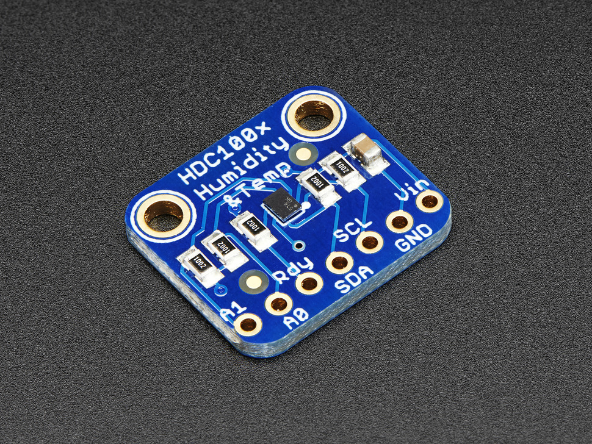
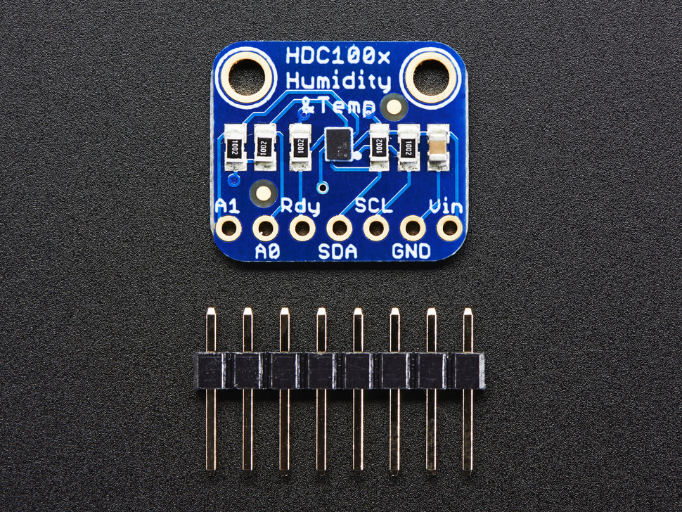

# Nome do sensor: HDC1008

- Classificação: umidade e temperatura
- Nome técnico: HDC1008

## Características

Sensor de umidade digital de baixa potência e alta precisão com sensor de temperatura

Ideal para termostatos inteligentes e monitores de sala, linha branca, impressoras, medidores portáteis, dispositivos médicos, transporte de carga, desembaçamento do pára-brisa automotivo, dispositivos vestíveis e dispositivos móveis.

### Sensibilidade Level-1-260C-UNLIM

### Faixa

Umidade: de 0% a 100%
Temp: -20°C a 85°C (operacional); -40°C a 125°C (funcional)

### Precisão

### Exatidão

Umidade: ±4%
Temp: ±0.2°C

### Resolução

Umi: 8 ou 11 ou 14 bit
Temp: 11 ou 14 bit

### Offset

não encontrei

### Linearidade

não encontrei

### Histerese

±1 %RH

### Tempos de resposta

Temp: 15 s

### Linearidade dinâmica

não encontrei

## Fotos

## Referências

[Datasheet](http://google.com)
https://pdf1.alldatasheet.com/datasheet-pdf/view/737751/TI/HDC1008_15.html