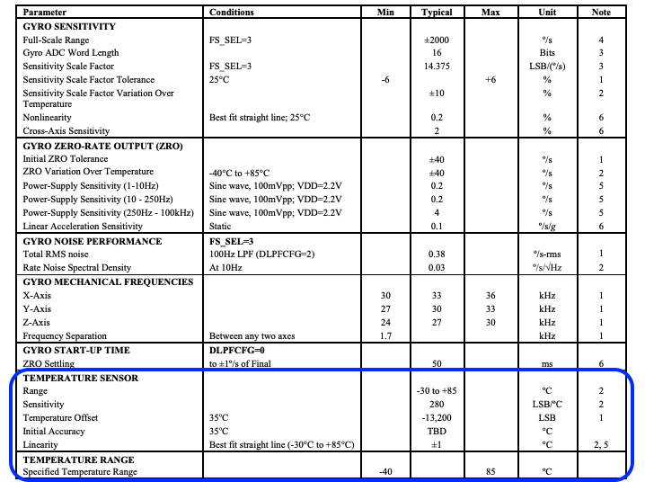

# Motion Sensors - Gyroscopes (ITG-3200)

- Classifications: Motion, direction of movement and orientation

Gyroscopes, or gyros, are devices that measure or maintain rotational motion. MEMS (microelectromechanical system) gyros are small, inexpensive sensors that measure angular velocity. The units of angular velocity are measured in degrees per second (°/s) or revolutions per second (RPS). Angular velocity is simply a measurement of speed of rotation. 
Gyros, can be used to determine orientation and are found in most autonomous navigation systems. For example, if you want to balance a robot, a gyroscope can be used to measure rotation from the balanced position and send corrections to a motor.

MEMS gyroscopes are used in automotive roll-over prevention and airbag systems, image stabilization, and have many other potential applications which are related to the importance of orientation. However, unlike Accelerometer which measures linear acceleration, Gyroscope calculates angular rotational velocity. Both Accelerometer and Gyroscope complement each other to offer precise findings. Accelerometer and Gyroscope are often present on the same chip or are combined together. If you wish to experience VR Apps and use VR headsets with your phone, Gyroscope is sort of mandatory.

#### Principle descriptions:
When things rotate around an axis they have what’s called angular velocity. A spinning wheel can be measured in revolutions per second (RPS) or degrees per second (°/s).

- Note that the z axis of the gyro below aligns with the axis of rotation on the wheel.

If you attach the sensor to the wheel shown above, you can measure the angular velocity of the z axis of the gyro. The other two axes would not measure any rotation.

Imagine if the wheel spins once per second. It would have an angular velocity of 360 degrees per second. The spinning direction of the wheel is also important. Is it clockwise around the axis, or is it counter-clockwise?

A triple axis MEMS gyroscope, similar to the one pictured above (ITG-3200), can measure rotation around three axes: x, y, and z. Some gyros come in single and dual axis varieties, but the triple axis gyro in a single chip is becoming smaller, less expensive, and more popular.

Gyros are often used on objects that are not spinning very fast at all. Aircrafts (hopefully) do not spin. Instead they rotate a few degrees on each axis. By detecting these small changes gyros help stabilize the flight of the aircraft. Also, note that the acceleration or linear velocity of the aircraft does not affect the measurement of the gyro. Gyros only measure angular velocity.

A vibrating structure gyroscope, defined by the IEEE as a Coriolis vibratory gyroscope (CVG), is a gyroscope that uses a vibrating structure to determine the rate of rotation. A vibrating structure gyroscope functions much like the halteres of flies (insects in the order Diptera).

The underlying physical principle is that a vibrating object tends to continue vibrating in the same plane even if its support rotates. The Coriolis effect causes the object to exert a force on its support, and by measuring this force the rate of rotation can be determined.

Vibrating structure gyroscopes are simpler and cheaper than conventional rotating gyroscopes of similar accuracy. Inexpensive vibrating structure gyroscopes manufactured with MEMS technology are widely used in smartphones, gaming devices, cameras and many other applications.

How does the MEMS gyro detect angular velocity?

Internal operational view of a MEMS gyro sensor

The gyroscope sensor within the MEMS is tiny (between 1 to 100 micrometers, the size of a human hair). When the gyro is rotated, a small resonating mass is shifted as the angular velocity changes. This movement is converted into very low-current electrical signals that can be amplified and read by a host microcontroller.

## Applications

#### Automotive
Automotive yaw sensors can be built around vibrating structure gyroscopes. These are used to detect error states in yaw compared to a predicted response when connected as an input to electronic stability control systems in conjunction with a steering wheel sensor. Advanced systems could conceivably offer rollover detection based on a second VSG but it is cheaper to add longitudinal and vertical accelerometers to the existing lateral one to this end. 
#### Safety in driving system

#### Entertainment
The Nintendo Game Boy Advance game WarioWare: Twisted! uses a piezoelectric gyroscope to detect rotational movement. The Sony SIXAXIS PS3 controller uses a single MEMS gyroscope to measure the sixth axis (yaw). The Nintendo Wii MotionPlus accessory uses multi-axis MEMS gyroscopes provided by InvenSense to augment the motion sensing capabilities of the Wii Remote.Most modern smartphones and gaming devices also feature MEMS gyroscopes.

#### Hobbies
Vibrating structure gyroscopes are commonly used in radio-controlled helicopters to help control the helicopter's tail rotor and in radio-controlled airplanes to help keep the altitude steady during flight. They are also used in multirotor flight controllers, since multirotors are inherently aerodynamically unstable and cannot stay airborne without electronic stabilization.

#### Industrial robotics
Epson Robots uses a quartz MEMS gyroscope, called QMEMS, to detect and control vibrations on their robots. This helps the robots position the robot end effector with high precision in high speed and fast-deceleration motion.

#### Photography
Many image stabilization systems on video and still cameras employ vibrating structure gyroscopes.

#### Spacecraft orientation
The oscillation can also be induced and controlled in the vibrating structure gyroscope for the positioning of spacecraft such as Cassini–Huygens.These small hemispherical resonator gyroscopes made of quartz glass operate in vacuum. There are also prototypes of elastically decoupled cylindrical resonator gyroscopes (CRG)made from high-purity single-crystalline sapphire. The high-purity leuko-sapphire have Q-factor an order of value higher than quartz glass used for HRG, but this material is hard and has anisotropy. They provide accurate 3 axis positioning of the spacecraft and are highly reliable over the years as they have no moving parts.

#### Head movement detector
The Segway Human Transporter uses a vibrating structure gyroscope made by Silicon Sensing Systems to stabilize the operator platform.

[https://www.researchgate.net/figure/Gyroscope-Signal-Pattern-During-Rightward-Rightward-Head-Movement-The-Figure-6-and-7_fig6_316451879](https://www.researchgate.net/figure/Gyroscope-Signal-Pattern-During-Rightward-Rightward-Head-Movement-The-Figure-6-and-7_fig6_316451879)

#### Glove as a mouse:
#### Using the glove as a mouse
https://blogs.aalto.fi/nanonuppu/2017/03/06/glove-as-a-mouse/

#### drone stability

### Features
#### The ITG-3200 triple-axis MEMS gyroscope includes a wide range of features:
#### Digital-output X-, Y-, and Z-Axis angular rate sensors (gyros) on one integrated circuit with a sensitivity of
#### 14.375 LSBs per °/sec and a full-scale range of ±2000°/sec
#### Three integrated 16-bit ADCs provide simultaneous sampling of gyros while requiring no external multiplexer
#### Enhanced bias and sensitivity temperature stability reduces the need for user calibration
#### Low frequency noise lower than previous generation devices, simplifying application development and making
#### for more-responsive motion processing
#### Digitally-programmable low-pass filter
#### Low 6.5mA operating current consumption for long battery life
#### Wide VDD supply voltage range of 2.1V to 3.6V
#### Flexible VLOGIC reference voltage allows for I2C interface voltages from 1.71V to VDD
#### Standby current: 5µA
#### Smallest and thinnest package for portable devices (4x4x0.9mm QFN)
#### No high pass filter needed
#### Turn on time: 50ms
#### Digital-output temperature sensor
#### Factory calibrated scale factor
#### 10,000 g shock tolerant
#### Fast Mode I
#### 2C (400kHz) serial interface
#### On-chip timing generator clock frequency is accurate to +/-2% over full temperature range
#### Optional external clock inputs of 32.768kHz or 19.2MHz to synchronize with system clock
#### MEMS structure hermetically sealed and bonded at wafer level
#### RoHS and Green compliant

## characteristics
ITG-3200:
[https://www.sparkfun.com/datasheets/Sensors/Gyro/PS-ITG-3200-00-01.4.pdf](https://www.sparkfun.com/datasheets/Sensors/Gyro/PS-ITG-3200-00-01.4.pdf)

## Sensitivity
The sensitivity is measured in mV per degree per second (mV/°/s). The dimension determines how much the voltage changes for a given angular velocity. For example, if a gyro is specified with a sensitivity of 30mV/°/s and you see a 300mV change in the output, you rotated the gyro at 10 °/s.

## Bias
As with any sensor, the values you measure will contain some amount of error or bias. You can see gyro bias by measuring the output when the gyro is still. Though you’d think you would see 0° when the gyro is still, you will always see a slight non-zero error in the output. These errors are sometimes called bias drift or bias instability. The temperature of the sensor greatly affects the bias. To help minimize the source of this error, most gyros have a built in temperature sensor. Thus, you are able to read the temperature of the sensor and correct or any temperature dependent changes. In order to correct for these errors, the gyro must be calibrated. This is usually done by keeping the gyro still and zeroing all of the readings in your code.

## Photo

## Referências

#### Different kinds of Gyroscope sensors
[https://en.wikipedia.org/wiki/Vibrating_structure_gyroscope](https://en.wikipedia.org/wiki/Vibrating_structure_gyroscope)

[https://standards.ieee.org/standard/1431-2004.html](https://standards.ieee.org/standard/1431-2004.html)

[Sensors](https://www.sciencedirect.com/science/article/pii/B9780124201651000214)

[https://learn.sparkfun.com/tutorials/gyroscope/all](https://learn.sparkfun.com/tutorials/gyroscope/all)

[LPY503AL](https://www.sparkfun.com/datasheets/Sensors/IMU/lpy503al.pdf?_ga=2.250152192.742813145.1599426736-308598555.1599165260)

[ITG-3200](https://www.sparkfun.com/datasheets/Sensors/Gyro/PS-ITG-3200-00-01.4.pdf)

[I3G4250D-1](https://www.digikey.be/product-detail/nl/stmicroelectronics/I3G4250DTR/497-15699-1-ND/5267985)

[I3G4250D-2](https://www.digikey.be/product-detail/nl/stmicroelectronics/I3G4250DTR/497-15699-1-ND/5267985)

[more](https://www.digikey.be/nl/articles/apply-sensor-fusion-to-accelerometers-and-gyroscopes)
