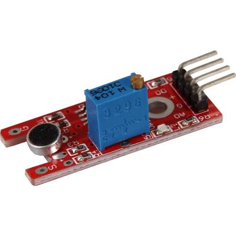

# KY-038

- Classificação: som
- Nome técnico: KY-038, chip LM393

## Características

Mede a intensidade sonora do ambiente ao seu redor e tem tanto saída digital como analógica.

3 componentes na placa: o sensor, um amplificador de sinal e um comparador.

Contém 2 LEDs, um para indicar que está recebendo energia e outro que indica que ele atingiu um valor determinado.

### Sensibilidade

Ajustável com potenciômetro. Quando menor a sensibilidade, maior deve ser o som para ativar o sensor.

### Faixa

Não registra valores absolutos, mas sim valores relativos a um valor extremo definido.

### Precisão

Não há referência à precisão, pois não registra valores absolutos.

### Exatidão

Não há referência à exatidão, pois não registra valores absolutos.

### Resolução

Pelo que entendi, também é definida pelo potenciômetro.

### Offset

Não especificado. (Encontrei em alguns lugares que ele tem um ganho de 20dB, mas acho que não seria considerado offset)

### Linearidade

Não especificado.

### Histerese

Pelo que entendi, não se aplica pois apenas mede o valor em relação a outro valor pré-definido.

### Tempos de resposta

Não especificado. (Como o sinal passa por um processo de amplificação, presumo que isso deve ter influência significativa)

### Linearidade dinâmica

Não especificado.

## Fotos

## Referências

[Google](http://google.com)
[Datasheet](https://datasheetspdf.com/pdf-file/1402048/Joy-IT/KY-038/1)
[FilipeFlop](https://www.filipeflop.com/produto/sensor-de-som-ky-038-microfone/)
[Arduino Learning](http://arduinolearning.com/amp/code/ky038-microphone-module-and-arduino-example.php)