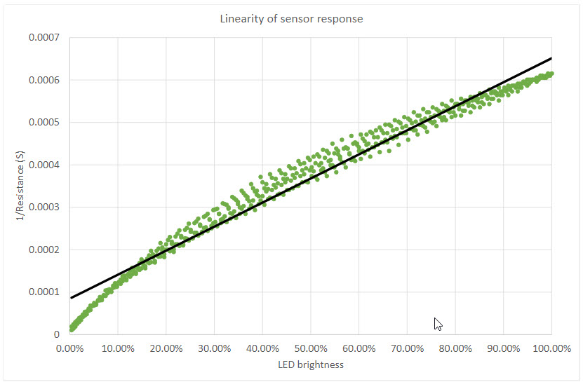
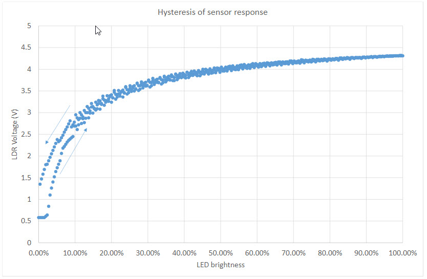
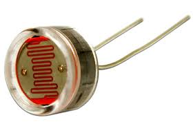

## Nome do sensor: LDR

 - Classificação: luminosidade.
 - Nome técnico: LDR - Light Dependent Resistor
 
O LDR, da sigla Light Dependent Resistor, ou “Sensor de luminosidade” é um sensor analógico, que fornece um valor em função da intensidade da incidência de luz detectada, à medida que a intensidade da luz aumenta, a sua resistência diminui.
Para leituras em portas analógicas do Arduino, esse valor pode variar de 0  a 1023 - 0volt a 5volts
Quando o LDR é colocado em um local escuro, ele terá sua máxima resistência que pode chegar a alguns Mega Ohms e conforme recebe incidência de luz sobre o sensor, sua resistência começará a diminuir para alguns Ohms. Desta forma, ele pode detectar a quantidade de luz que incide sobre ele e, portanto, pode prever, por exemplo se é dia ou noite, ou detectar um ambiente claro ou escuro.

## Características

## Sensibilidade
400nm – 1000nm (25ºC)
Fonte: https://www.electroschematics.com/wp-content/uploads/2012/12/PDV-P8103-ldr.pdf

## Faixa

10lux-1000Lux
Fonte: https://components101.com/sites/default/files/component_datasheet/LDR%20Datasheet.pdf

### Precisão
Entre 10 lux e 100 lux:

γ=log(R10/R100) / log(100/10)=log(R10/R100)
R10, R100: resistência a 10 lux e 100 lux. 
A tolerância de γ é ±0.1. 

Fonte: http://ronja.twibright.com/datasheets/cds-resistor-pgm.pdf

### Exatidão
não encontrado

### Resolução
não encontrado

### Offset
não encontrado

### Linearidade
Pelo gráfico há uma indicação de linearidade entre a resistência e a intensidade da luz



LDR resposta usada em 50ms entre cada valores
Fonte: https://www.bwp.io/Arduino-Workshops/coding-and-sensors/hysteresis/

### Histerese
Exemplo de Cálculo para histerese **(pode ser obtida no terminal do Arduino)**

    void setup() {
      pinMode(3, OUTPUT);
      Serial.begin(9600);
    }
    void loop() {
      int i;
      for (i = 0; i <= 255; i++) {
        analogWrite(3, i);
        Serial.print("Brightness: ");
        Serial.print(i / 2.55, 6); // 2nd parameter: 6 decimal points
        Serial.print("%");
        Serial.println();
      }
    }

Exemplo de uma saída:
```
0.00% 2.84
1.96% 2.95
3.92% 3.03
5.88% 3.12
...
```


Fonte: https://www.bwp.io/Arduino-Workshops/coding-and-sensors/hysteresis/

### Tempos de resposta
30 - 40 ms
Fonte: http://ronja.twibright.com/datasheets/cds-resistor-pgm.pdf

## Fotos


## Referências

