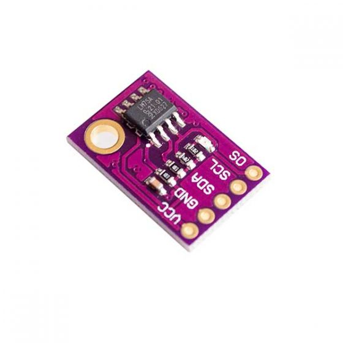

# LM75 Temperature Sensor Module

- Classificação: Temperatura
- Nome técnico: LM75

Sensor de temperatura que pode ser usado em aplicações de controle industrial e monitoramento do ambiente.

## Características

### Sensibilidade
0.5°C

### Faixa
–55°C a 125°C

### Precisão
Não especificado

### Exatidão
* Diferença de ±2°C entre -25°C e 100°C 
* Diferença de ±3°C entre -55°C e 125°C. 

### Resolução
9 bits

### Offset
Não especificado

### Linearidade
Não especificado

### Histerese
Não especificado

### Tempos de resposta
Entre 100 e 300ms

### Linearidade dinâmica
Não especificado

## Fotos

## Referências
* [Components 101](https://components101.com/modules/lm75-temperature-sensor-module)
* [Data Sheet](https://components101.com/sites/default/files/component_datasheet/LM75-Temperature-Sensor-Module-Datasheet.pdf)
