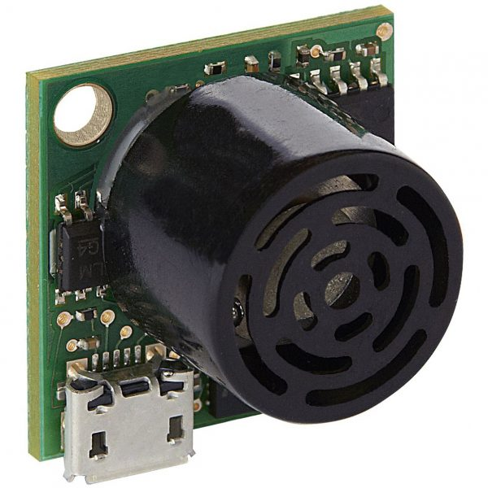

# MB14030

- Classificação: Sensor de Proximidade
- Nome técnico: MB1403

Sensor ultrasônico utilizado para medir a distância\proximidade entre o observador e um alvo. O sensor é indicado para detecção de pessoas, navegação autônoma e etc.

## Características

### Sensibilidade

O datasheet do sensor demonstrou sua reação (output) quando submetido a objetos de 6,35mm

### Faixa

Distância de 30 cm a 5 metros.
Proximidade 1-mm a 5 metros.

### Precisão

A acurácia do sensor é de 0,1%

### Exatidão

A acurácia do sensor é de 0,1%

### Resolução

1 mm

### Offset

A proximidade mínima reportada pelo sensor é de 30cm, assim, objetos cuja proximidade é inferior à 30cm serão reportadas como 300mm.

### Linearidade

Para medidas entre 30 e 50cm, foi observado erros de até 5mm. Não foram identificados erros em mesurações acima de 50cm.

### Histerese

Não informado.

### Tempos de resposta

128ms

### Linearidade dinâmica

Não informado.

## Fotos

## Referências

[maxbotix](https://www.maxbotix.com/documents/HRUSB-MaxSonar-EZ_Datasheet.pdf)
