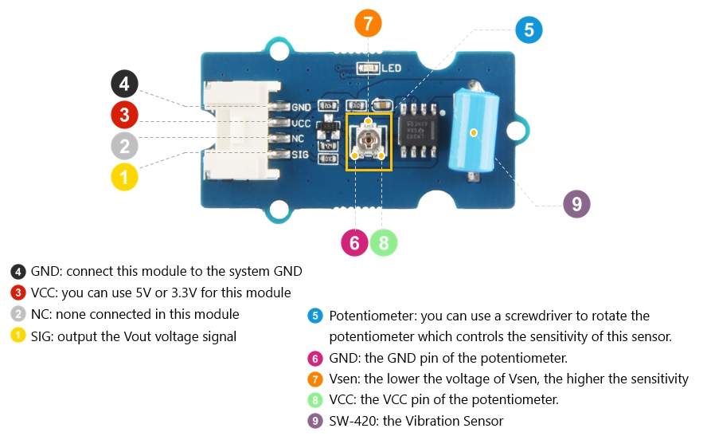

# Sensor de Vibração SW-420

- Classificação: vibração
- Nome técnico: SW-420

SW-420 é um sensor de vibração de alta sensitividade não direcional. Pode ser usado como alarme, indicando quando algo está sendo manipulado (como um carro ou bicicleta), ou quando um motor é ligado. Pode ainda ser usado em jogos.

## Características

- Não direcional
- Alta sensibilidade
- Responde à vibração e inclinação
- À prova d'água
- Resistente à compressão

Trata-se de um sensor de interface digital, isto é, quando não for detectada vibração, o output será HIGH. Entretanto, no momento que for detectada vibração ou movimento, o circuito é cortado e o output será LOW. Dessa maneira, alguns conceitos a seguir não fazem muito sentido.

Por outro lado, se realmente houver uma necessidade de uma medição em escala, pode-se utilizar múltiplos sensores calibrados para sensibilidades diferentes. Infelizmente, porém, não encontrei dados que indicariam faixa, precisão, exatidão, resolução, offset ou linearidade utilizando essa técnica.

### Sensibilidade

Pode ser ajustada com um potenciômetro (geralmente já incluído no módulo)

### Faixa

n/a

### Precisão

n/a

### Exatidão

n/a

### Resolução

n/a

### Offset

n/a

### Linearidade

n/a

### Histerese

Aparentemente, quase instantâneo.

### Tempos de resposta

Aparentemente, quase instantâneo.

### Linearidade dinâmica

n/a

## Fotos

## Referências

[Seeed studio Datasheet](https://media.digikey.com/pdf/Data%20Sheets/Seeed%20Technology/Grove_Vibration_Sensor_SW-420_Web.pdf)

[Video de demonstração - Canal Eletrônica para Todos](https://www.youtube.com/watch?v=vWT0l4bcpog)