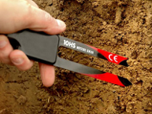
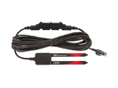

# S-SMD_M005

- Classificação: umidade de solo
- Nome técnico: S-SMD_M005

Este sensor pode ler um certo nível de umidade presente no solo ao seu redor. É um sensor ideal para monitorar um pequeno jardim.
Ele usa duas ponteiras para passar corrente através do solo, e então lê a resistência para adquirir o nível de umidade. Mais água faz o solo conduzir eletricidade mais facilmente (menos resistência) enquanto em um solo mais seco vai conduzir pouca eletricidade (mais resistência).

## Características

### Sensibilidade

- Ajustável via potenciômetro - 3,3 à 12V

### Faixa

- Temperatura de operação: 0° a 50 °C;

### Precisão

- ± 0,033 m³/m³ (± 3,3%) típica de 0° a 50 °C para solos minerais até 10 dS/m;
- ± 0,020 m³/m³ (± 2%) com calibração específica do solo.

### Exatidão

### Resolução

- 0,0008 m³/m³ (0,08%)

### Offset

### Linearidade

### Histerese

### Tempos de resposta

### Linearidade dinâmica

## Fotos

## Referências

[Sigma Sensors](https://sigmasensors.com.br/produtos/sensor-de-umidade-do-solo-plug-and-play-63780813-104e-4175-b044-409719a3255d)