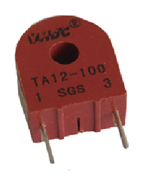

# Nome do sensor (LDR, DS18B20, etc)

- Classificação: corrente elétrica
- Nome técnico: TA12-100

Pequeno sensor de corrente alternada, que consiste em um transformador de centro nanocristalino totalmente fechado.

## Características

### Sensibilidade

Taxa de transformação: 1000:1
Resistência máxima de amostragem: 200Ω

### Faixa

Corrente de entrada: 0 A - 5 A
Corrente de saída: 0 mA - 5 mA
Faixa de Frequência: 20Hz - 20kHz
Temperatura de operação: -35ºC ~ + 85ºC

### Precisão
Não encontrado.

### Exatidão
+- 1%

### Resolução
Não encontrado.

### Offset
Não encontrado.

### Linearidade
<= 0.3%

### Histerese
Não encontrado.

### Tempos de resposta
Não encontrado.

### Linearidade dinâmica
Não encontrado.

## Fotos

## Referências

[Alldatasheet](https://html.alldatasheet.com/html-pdf/1159415/YHDC/TA12-100/112/1/TA12-100.html)

[Electronicoscaldas](http://www.electronicoscaldas.com/datasheet/TA12-TA12L-Series_YHDC.pdf)