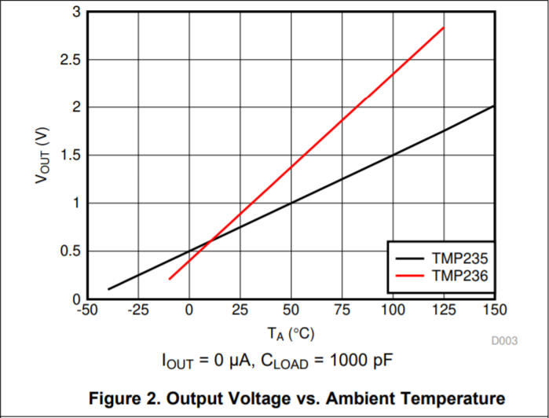
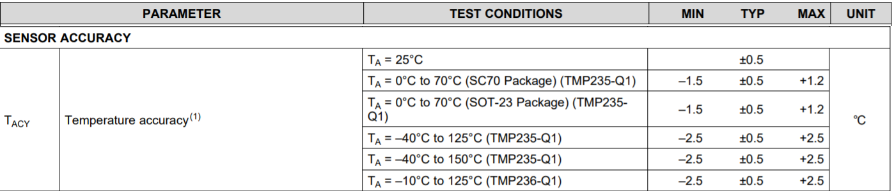
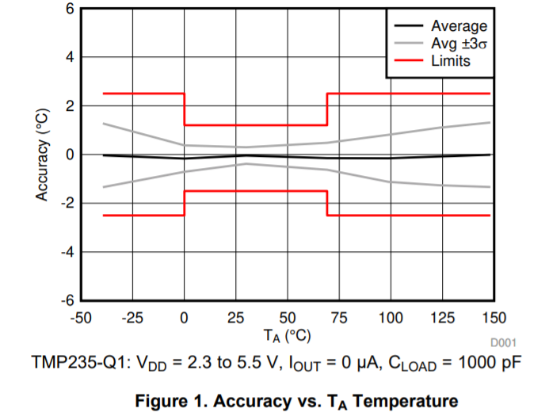
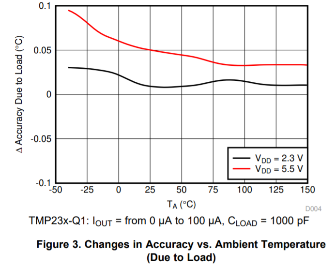
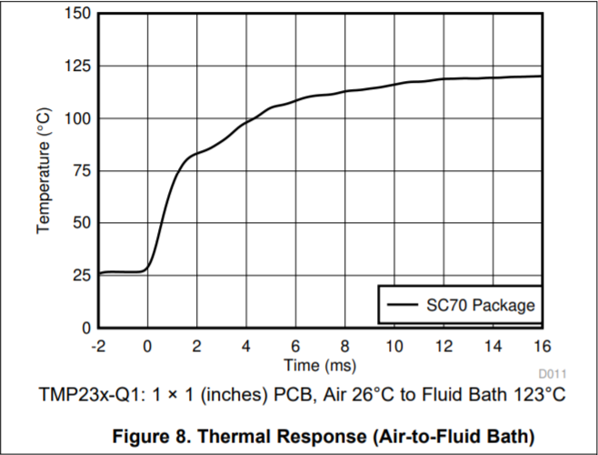
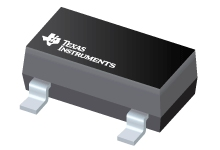
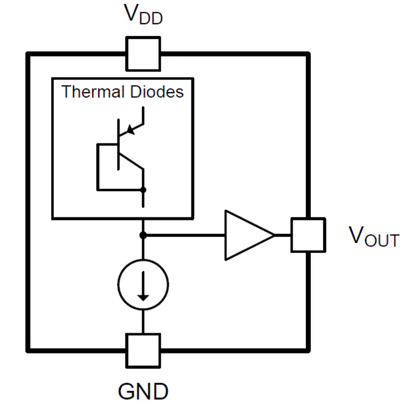

# TMP235-Q1

- Classificação: temperatura
- Nome técnico: TMP235-Q1

Esse sensor mede a temperatura do ambiente ao seu redor e emite um sinal analógico (tensão elétrica) como medição. Tendo passado no teste de estresse para falhas mecânicas AEC-Q100 e tendo uma ótima precisão, esse sensor serve principalmente para aplicações automotivas.

## Características

### Sensibilidade

**Gráfico da variação da voltagem de saída de acordo com a temperatura**

Segundo descrição textual, a sensibilidade padrão é de 10 mV/°C. Porém, na seção 7.3 do manual, é especificado um pequeno ganho adicional na voltagem de saída em faixas de temperaturas maiores, sendo a sensibilidade padrão válida entre -40°C e 100°C. Entre 100°C e 125°C, a sensibilidade é de 10.1 mV/°C. Entre 125°C e 150°C, 10.6 mV/°C.

### Faixa

Faixa de temperatura: –40°C a +150°C.

### Precisão

Sem dados

### Exatidão

Sem dados

### Acurácia

**Tabela com a acurária do sensor**

Segundo a tabela, a acurácia típica do sensor é de ±0.5°C, com valores máximos e mínimos de acurácia dependendo de certas condições.

(1) Acurácia é definida como o erro entre o valor medido e o valor tabulado na Tabela 3 do manual encontrado nas referências (manual da Texas Instrument), que contém a relação entre a temperatura ambiente e uma tensão registrada. Para mais detalhes sobre a nota, cheque o manual.

**Gráfico da acurácia vs temperatura**

O gráfico mostra como a acurácia varia de acordo com a temperatura, mostrando a acurácia média, a média mais 3 vezes o desvio padrão e os valores limitantes.

**Gráfico da variação da acurácia em cada temperatura**

Esse gráfico mostra a variação de acurácia em cada faixa de temperatura resultante de processos físicos do sensor.

### Resolução

Sem dados

### Offset

*Offset* de 500 mV em ambientes a 0°C

### Linearidade

O erro de linearidade, ou, como descrito no manual, a não-linearidade da saída, quando testado em um ambiente de 0°C a 70°C sem *load regulation*, é de ±0.5°C.

### Histerese

Sem dados

### Tempos de resposta

Não foi diretamente explicitado, mas temos informações sobre a *thermal response* (resposta térmica) do sensor, que aqui representa o tempo que o sensor leva para realizar 63% do processo de captar a nova temperatura ao sofrer uma mudança brusca de temperatura. Segundo o manual, esse tempo, quando o sensor transita de um ambiente de 30°C (ar) para 125°C (_fluid bath_), a *thermal response* é de 1.3 segundos.

Abaixo, gráfico do tempo de tempo de resposta termal do sensor:

Considerando o artigo presente nas referências, caso consideremos esse valor como a constante de tempo do sensor τ (tau) e o tempo de resposta do sensor como 5 vezes esse valor (como descrito no artigo, de forma que tenha sido realizado 99.3% do processo de captura da nova temperatura), teríamos um tempo de resposta de 6.5 segundos.

### Linearidade dinâmica

Sem dados

## Fotos

## Referências

[Manual](https://www.ti.com/lit/ds/symlink/tmp235-q1.pdf?ts=1599260316161&ref_url=https%253A%252F%252Fwww.ti.com%252Fproduct%252FTMP235-Q1)

[Artigo sobre tempo de resposta](https://www.baranidesign.com/faq-articles/2019/5/6/difference-between-sensor-response-time-and-sensor-time-constant-tau)