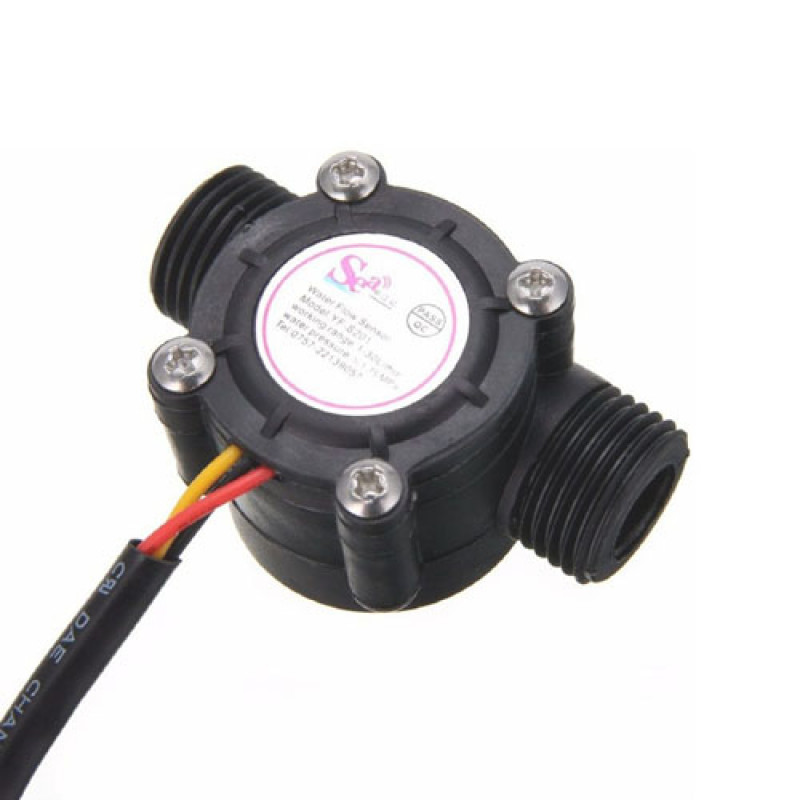

# Nome do sensor (LDR, DS18B20, etc)

- Classificação: fluxo
- Nome técnico: YF-S201

O Sensor de Fluxo de Água 1/2" YF-S201 é utilizado para medir o fluxo de água em um cano.

## Características

### Sensibilidade
Os pulsos emitidos pelo sensor correspondem à aproximadamente 2.25ml de água, então essa deve ser a menor quantidade possível a ser detectada.

### Faixa
1L/min a 30L/min.

### Precisão
10% sem necessidade de calibração.
Caso seja necessário maior precisão, é necessário realizar uma calibração do sensor.

### Exatidão
10%.

### Resolução
Como descrito na sensibilidade, a resolução deve ser 2.25 ml.

### Offset
É necessário realizar calibração se for necessária precisão > 10%, mas não está indicado como. Além disso, características como viscosidade do líquido, pressão do líquido e orientação do sensor podem interferir nas medições, gerando um offset.

### Linearidade
Não foi possível encontrar informações sobre a linearidade.

### Histerese
Não foi possível encontrar informações sobre a histerese.

### Tempos de resposta
Tempo de subida: $$4 \mu s$$.
Tempo de descida: $$18 \mu s$$.

### Linearidade dinâmica
Não foi possível encontrar informações sobre a linearidade dinâmica.

## Fotos

## Referências

[Baú da Eletrônica](https://www.baudaeletronica.com.br/sensor-de-fluxo-de-agua-1-2-yf-s201.html)

[Casa da Robótica](https://www.casadarobotica.com/sensores-e-modulos/sensores/outros/sensor-fluxo-vazao-de-agua-1-2-1a-30-litros-min-yf-s201)

[HobbyTronics](https://www.hobbytronics.co.uk/yf-s201-water-flow-meter)
