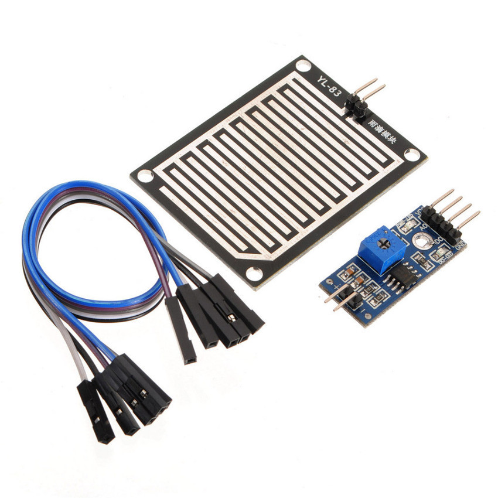
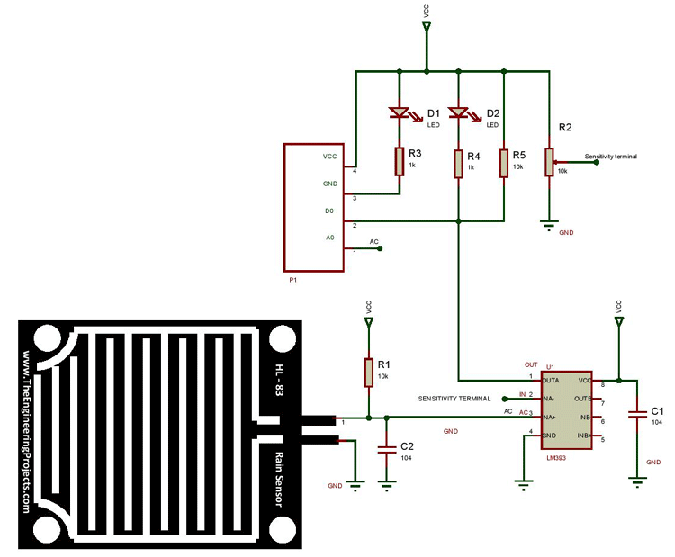

# YL-83

- Classificação: umidade, chuva
- Nome técnico: YL-83, FC-37 ou HL-83

O sensor YL-83 é composto por uma placa de sensor capacitivo acoplada a uma placa de aquecimento e normalmente é acompanhado por um comparador LM393 que permite, além da saída análogica correspondendo à umidade do sensor, uma saída digital, indicando a presença de chuva.

Graças à placa de aquecimento acoplada, é possível, manter o sensor livre de neve e condensamento de água.

O funcionamento do sensor assemelha-se ao funcionamento de outros sensores capacitivos, como telas de toque, sensores de pressão, nível de água, etc., porém **não foi encontrada nenhuma** referência que relacionasse a medida da grandeza (capacitância) a qual o sensor é sensivel (*farad*) com as características de funcionamento dos sensores, o que impossibilita a análise das características a seguir.

## Características

- Área da placa capacitiva: 50 x 40 mm
- Corrente típica do sensor: <150 mA
- Corrente máxima de entrada do sensor: 260 mA
- Potência de aquecimento: 0.5 ... 2.3 W
- Voltagem máxima de saída do sensor: 15 V
- Corrente máxima de saída do sensor: 50 mA
- Saída analógica do sensor: 1 ... 3 V
- Frequência de saída do sensor: 1.5 ... 6 KHz
- Temperatura de operação: -15 ... +55°C

### Sensibilidade

N/A

### Faixa

N/A

### Precisão

N/A

### Exatidão

N/A

### Resolução

N/A

### Offset

N/A

### Linearidade

N/A

### Histerese

N/A

### Tempos de resposta

N/A

### Linearidade dinâmica

N/A

## Fotos

## Referências

[Documentação do sensor](https://urolakostapk.files.wordpress.com/2016/10/yl-83-rain-detector-datasheet_low.pdf)

[Exemplo de projeto 1](http://acoptex.com/project/185/basics-project-039a-rain-sensor-fc-37-or-yl-83-at-acoptexcom/)

[Exemplo de projeto 2](https://components101.com/sensors/rain-drop-sensor-module)

[Exemplo de projeto 3](https://www.openhacks.com/uploadsproductos/rain_sensor_module.pdf)

[Documentação do comparador](https://www.adrobotica.com/wp-content/uploads/2018/02/datasheet-LM393.pdf)

[Sensores capacitivos](https://automation-insights.blog/2017/06/07/what-is-a-capacitive-sensor/)