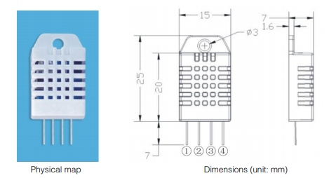

## Nome do sensor (DHT22 ou AM2302): 
	- Classificação: temperatura e umidade; - Nome técnico: DHT22 ou AM2302

## Características: 
	Este sensor permite fazer leituras de temperaturas entre -40 a +80 graus Celsius e umidade entre 0 a 100%.

### Sensibilidade: 
	umidade 0.1%RH; temperatura 0.1ºC

### Faixa: 
	Umidade de 0% a 100%; temperatura de -40 ºC a 80ºC

### Precisão: 
	umidade +-2% RH(Max +-5%RH) a 25ºC; temperatura <+-0.5ºC

### Exatidão 
	umidade +-2% RH(Max +-5%RH) a 25ºC; temperatura <+-0.5ºC
	
### Resolução  
	umidade 0.1%RH; temperatura 0.1ºC

### Offset n/a

### Linearidade n/a

### Histerese 
	umidade: +-0.3%RH

### Tempos de resposta : 2s

### Linearidade dinâmica: n/a

## Fotos

## Referências

[FilipeFlop.com](https://img.filipeflop.com/files/download/Datasheet_DHT22_AM2302.pdf)
[DataSheet.pdf](https://datasheetspdf.com/datasheet/DHT22.html)
