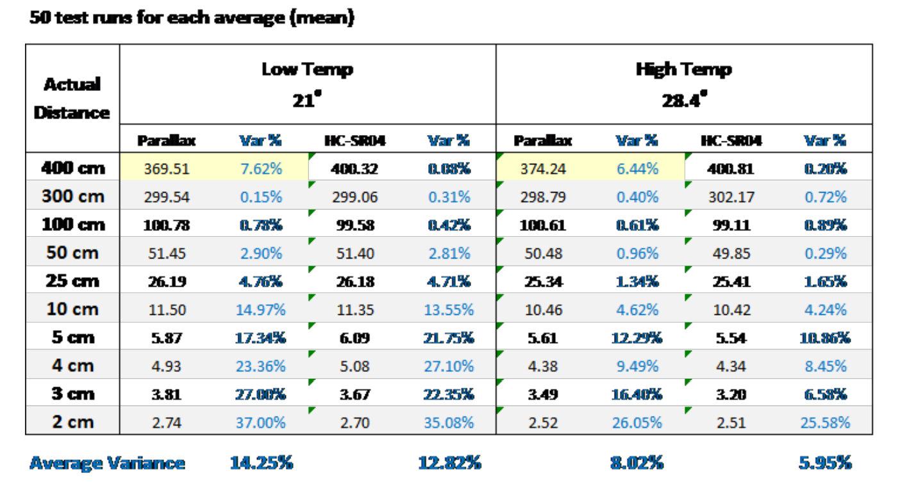
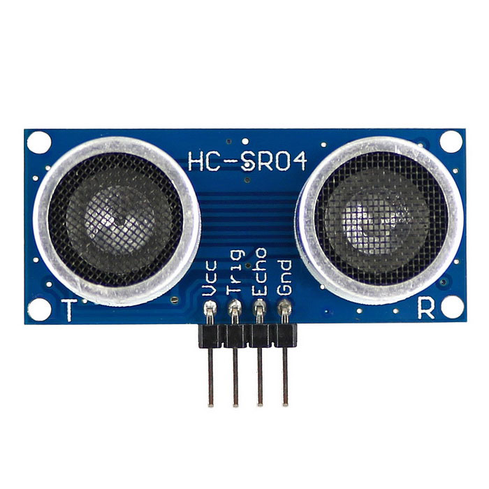
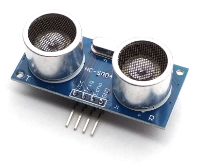
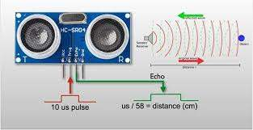

# HC-SR04

- Classificação: Proximidade
- Nome técnico: HC-SR04

O sensor HC-SR04 realiza a medição da proximidade de objetos através da emissão de ondas ultrassônicas. O módulo possui
dois microfones, sendo um responsável por enviar as ondas sonoras e outro por receber a reflexão destas últimas. O envio
dos sinais é realizado pela vibração de um cristal piezoeléctrico, o qual quando excitado por um estímulo elétrico,
realiza um movimento mecânico de vibração. O contrário ocorre para recepção, onde vibrações induzidas no cristal, pelas
ondas que atingem os detectores, geram corrente elétrica.

Baseado no tempo transcorrido entre a emissão e recepção do pulso sonoro, o sensor transmite um sinal por seu pino de
output, de tamanho proporcional à distância do objeto ao sensor.

O sensor possui baixo custo e é ideal para medir pequenas distâncias de até 4m, tendo melhor desempenho na faixa de 50cm
à 3m. É encontrado por menos de R$ 13,00 em sites de vendas de componentes eletrônicos.

Este é ideal para uso em ambientes onde não exista muito ruído, tendo um baixo custo e boa precisão para médias distâncias (maior do que 50 cm e menor do que 5m). Sua capacidade de medição depende do material com o qual interage, uma vez que determinados materiais podem absorver as ondas sonoras e refletir em uma intensidade insuficiente para que o receptor registre-a. A angulação dos objetos detectados com relação ao sensor também é um fator limitante, uma vez que quanto mais próximo do centro, melhor será a medição, e quanto mais afastado, mais ruído e perda de intensidade afetará o sinal.

Este tipo de sensor pode ser utilizado para impedir colisões de objetos móveis com obstáculos, detectar a presença de pessoas ou animais em determinados ambientes, medir a velocidade de descolamento de objetos, alarmes de segurança baseados na detecção de presença em determinada área restrita, bem como para a medição do nível de reservatórios de água ou outros líquidos.

## Características

### Sensibilidade: -65dB min

### Faixa: Min 2cm | Máx 400cm (distância) - Máx 30º (espacial)

### Precisão: ~0.1cm - 0.5cm
A precisão indicada foi determinada em um estudo independente denominado "HC-SR04 Ultrasonic Sensor – Accuracy and
Resolution Tests". Nele também foi determinada uma resolução espacial, exatidão, e FOV.

Apesar de não especificado nos datasheets do sensor, há um experimento realizado com dois sensores ultrassônicos que
determinou as variâncias percentuais em diferentes distâncias e em temperaturas distintas.

A precisão do sensor é extremamente reduzida em distâncias menores do que 25cm e volta a reduzir por volta de 4m. Esta
também varia com a temperatura e ângulo do objeto com relação ao centro do sensor.

### Exatidão: 0.035cm

A afirmação encontrada no estudo bate com as encontradas em sites de eletrônica e de vendedores, a qual é em geral d 0.3mm.

### Resolução: 0.3cm (distância) e ~0.6º-1.4º (resolução espacial).

### Tempos de resposta: Variável (10us para input + 50*dist_cm us)

Depende da Distância do objeto, uma vez que o tamanho do output determina a valor da distância, conforme a imagem abaixo

### Ângulo de medição: 15º

Dentro deste ângulo é possível receber sinais com exatidão. Em ângulos maiores os resultados serão comprometidos.

### Frequência de operação: 40kHz

### Dimensões: 45mm * 20mm * 15mm

## Não especificado

### Linearidade dinâmica
### Offset
### Linearidade
### Histerese

## Fotos

## Referências

[HC-SR04 Ultrasonic Sensor Module](http://www.handsontec.com/pdf_files/hc-sr04-User-Guide.pdf)
[HC-SR04 User Guide](https://www.mpja.com/download/hc-sr04_ultrasonic_module_user_guidejohn.pdf)
[HC-SR04 ULTRASONIC SENSOR – ACCURACY AND RESOLUTION TESTS](https://app.box.com/s/sj7du1n32in2777rcoi2)
[Ultrasonic Sensor Comparison](https://cuspsensors.files.wordpress.com/2015/05/ultrasonic_sensor_comparison.pdf)
[Sparkfun: Ultrasonic Distance Sensor - HC-SR04](https://www.sparkfun.com/products/15569#:~:text=This%20is%20the%20HC%2DSR04,receiver%20and%20a%20control%20circuit.)
[HC-SR04 Datasheet](https://www.electroschematics.com/hc-sr04-datasheet/)