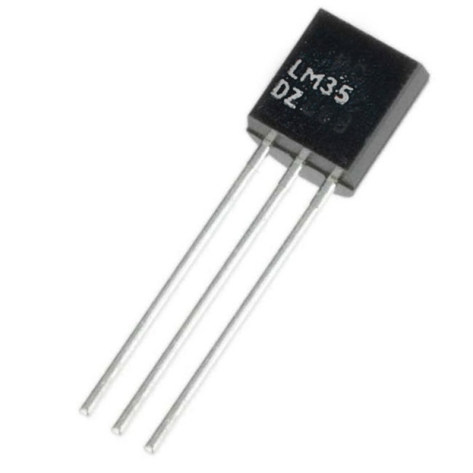

# LM35 

- Classificação: sensor de temperatura
- Nome técnico: LM35 (Texas Instruments)

O LM35 é um sensor de temperatura com vontagem de saída linearmente
proporcional à temperatura em graus centigrados. Uma vantagem do LM35 está na
comodidade em recuperar valores diretamente na escala Celsius, diferente de
outros sensores calibrados na escala Kelvin. Além disso, por requisitar apenas
60μA, o sensor esquenta muito pouco (menos de 0.1°C em ar parado). Dentre os
usos possíveis está o monitoramento de baterias e fontes de energia.

## Características

### Sensibilidade

Não informado.

### Faixa

Entre -55°C e 150°C.

### Precisão

A precisão típica é de até ± 0.5°C em temperatura ambiente e ± 0.75°C na faixa
total (−55°C a 150°C). O limite de precisão assegurado e testado em produção é
de ± 1.0°C em temperatura ambiente ± 1.5°C no intervalo total. (Para mais
informações ver tabela na pág. 8 do datasheet e gráfico de precisão na pág. 12).

### Exatidão

Não informado.

### Resolução

Não encontrei informações sobre resolução, apenas da taxa de conversão, que é de
10mV / ºC.

### Offset

Não é informado explicitamente, mas pelas informações do datasheet e utilização
no tutorial da referência [4], o offset parece ser nulo.

### Linearidade

Não informado.

### Histerese

Não informado.

### Tempos de resposta

3 minutos para obter 100% do valor final. Aproximadamente 1 minuto para 50%.

### Linearidade dinâmica

Não se aplica.

## Fotos

(Fonte: [https://www.baudaeletronica.com.br/sensor-de-temperatura-lm35.html](https://www.baudaeletronica.com.br/sensor-de-temperatura-lm35.html))

## Referências

1. [Datasheet](https://www.ti.com/lit/ds/symlink/lm35.pdf)
2. [Loja Bau da Eletronica](https://www.baudaeletronica.com.br/sensor-de-temperatura-lm35.html)
3. [Loja OpzLab](https://www.opzlab.com/product/lm35-analog-temperature-sensor/)
4. [Tutorial do LM35 no Vida de Silício](https://portal.vidadesilicio.com.br/lm35-medindo-temperatura-com-arduino/)
