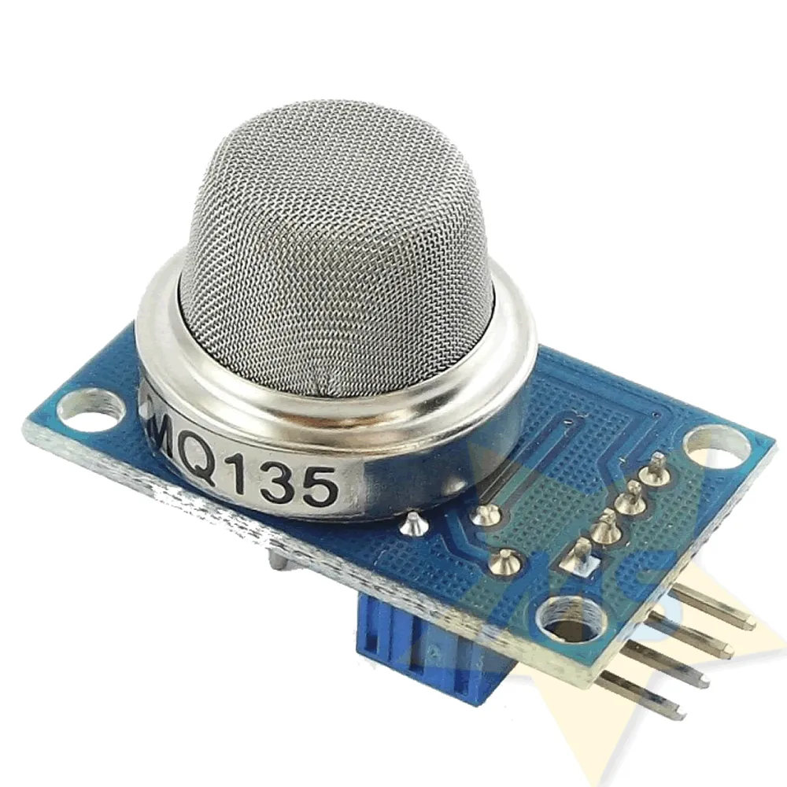

# MQ-135 - SENSOR DE GÁS

- Classificação: detector de gases
- Nome técnico: MQ-135

Este sensor detecta gases tóxicos como amônia, álcool, benzeno, dióxido de carbono, fumaça, e óxido nítrico. Pode ser utilizado na indústria e cidades inteligentes.

## Características

### Sensibilidade
O sensor detecta gases em concentração igual ou superior a 10 partes por milhão (ppm).

### Faixa

- Álcool: 10ppm - 300ppm

- Amônia: 10ppm - 300ppm

- Benzeno: 10ppm - 1000ppm

### Precisão
*(informação não encontrada)*

### Exatidão
*(informação não encontrada)*

### Resolução
*(informação não encontrada)*

### Offset
*(informação não encontrada)*

### Linearidade
*(informação não encontrada)*

### Histerese
*(informação não encontrada)*

### Tempos de resposta
As referências apontam que o sensor possui rápida resposta, porém não apontam valores.

### Linearidade dinâmica
*(informação não encontrada)*

## Fotos

## Referências

[components101](https://components101.com/sensors/mq135-gas-sensor-for-air-quality)
[alldatasheet.org](https://www.olimex.com/Products/Components/Sensors/Gas/SNS-MQ135/resources/SNS-MQ135.pdf)
