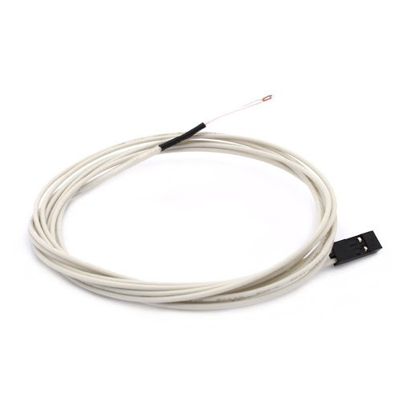

# Sensor Temperatura NTC 100K 1% B3950

- Classificação: temperatura.
- Nome técnico: NTC Thermistor

Um sensor de temperatura de baixo custo, muito utilizado em projetos como medidores de temperaturas

## Características

- Resistência: 100K ohms  a 25 °C
- Diâmetro do termistor: 1,25 mm (±0.2 mm)
- Cabo: de 1 metro com terminal fêmea duplo 2.54 mm

### Sensibilidade

Independente de sensibilidade.

### Faixa

Faixa de detecção: -50 a 260°C

### Precisão

1%

### Exatidão

1%

### Resolução

2.44 mV

### Offset

Regulável.

### Linearidade

### Histerese

### Tempos de resposta

Mede resistência, portanto, o tempo dessa medida.

< 7s para mudar 63.2% da diferença total entre a temperatura inicial e final do corpo.

### Linearidade dinâmica

Não especificada.

## Fotos

## Referências

[DataSheet](https://www.tme.eu/Document/f9d2f5e38227fc1c7d979e546ff51768/NTCM-100K-B3950.pdf)
[Imagem](https://www.mamuteeletronica.com.br/sensor-temperatura-ntc-100k-1-b3950-com-cabo-1-metro-entrada-jumper)