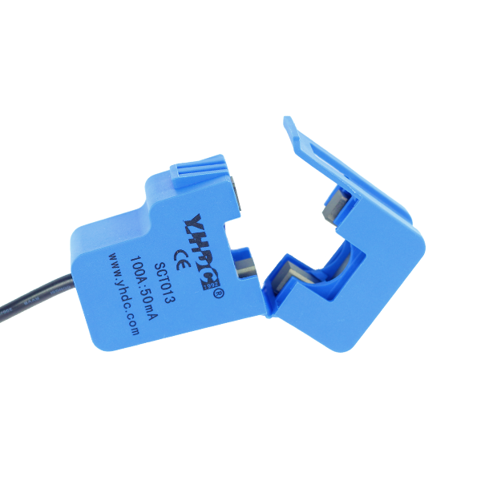

# SCT-013

- Classificação: corrente elétrica
- Nome técnico: SCT-013-000

Sensor de corrente alternada (AC) que mede até 100A. Sua principal vantagem é ser não-invasivo, o que facilita a instalação.
Pode ser usado em projetos com microcontroladores tipo Arduino, como automação residencial e gestão de energia.
Este modelo possui sinal de saída a corrente.

## Características

### Sensibilidade
A cada 1A, a saída varia em 0,5mA.
A sensibilidade final depende da montagem de hardware para medição (valor do resistor shunt).

### Faixa
Corrente de entrada: de 0 a 100A
Temperatura: de -25ºC a 70ºC
Corrente de saída: de 0 a 50 mA

### Precisão
Não encontrado.

### Exatidão
Não encontrado.

### Resolução
Não encontrado.

### Offset

### Linearidade
+- 3%

### Histerese
Não encontrado.

### Tempos de resposta
Não encontrado.

### Linearidade dinâmica
Não encontrado.

## Fotos

## Referências

[FilipeFlop](https://www.filipeflop.com/produto/sensor-de-corrente-nao-invasivo-100a-sct-013/)

[SCT013 Datasheet](https://storage.googleapis.com/baudaeletronicadatasheet/SCT-013.pdf)

[Tutorial SCT013](https://portal.vidadesilicio.com.br/sct-013-sensor-de-corrente-alternada/)
