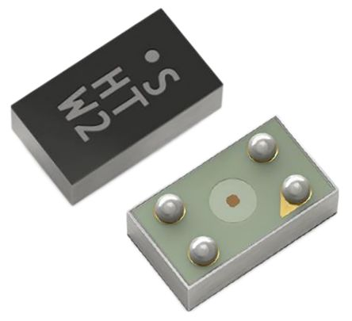

# SHTW2

- Classificação: Umidade e temperatura
- Nome técnico: SHTW2

O sensor SHTW2 é um sensor digital de humidade relativa do ar e temperatura, dentro de um pacote *flip chip*, o que implica em seu tamanho ultra-pequeno. Graças ao seu tamanho, este sensor é ótimo para aplicações em que não há muito espaço disponível para instalação de sensores.

## Características

### Sensibilidade

Único dado encontrado sobre esta propriedade foi referente ao nível de sensibilidade à umidade ([*Moisture Sensitivity Level* ou MSL](https://en.wikipedia.org/wiki/Moisture_sensitivity_level)) do sensor, que é nível 1.

### Faixa

Para umidade, sua faixa de medições é de 0 a 100 %RH. Para temperatura a faixa é de -30 a 100 °C.

### Precisão

A precisão do sensor, ou sua medida de reprodutibilidade, é de 0.1 %RH e 0.1 °C.

### Exatidão

A exatidão de medições do sensor para umidade e temperatura é, respectivamente, de ±3% RH e ±3°C.

### Resolução

A resolução do sensor é de 0.01 %RH para medições de umidade relativa e 0.01% °C para medições de temperatura.

### Offset

Não foram encontrados dados referentes ao *offset* do sensor.

### Linearidade

Não encontrado.

### Histerese

Não encontrado.

### Tempos de resposta

Para medições de umidade relativa, o tempo de resposta do sensor é de 8s. Já para medições de temperatura, o tempo de resposta está entre valores menores que 5s e 30s.

### Linearidade dinâmica

Não encontrado.

## Fotos

## Referências

[Official Data Sheet](https://www.sensirion.com/fileadmin/user_upload/customers/sensirion/Dokumente/2_Humidity_Sensors/Datasheets/Sensirion_Humidity_Sensors_SHTW2_Datasheet.pdf)

[Digikey.com](https://www.digikey.com/product-detail/en/sensirion-ag/SHTW2/1649-1061-1-ND/6181734)

[MSL](https://en.wikipedia.org/wiki/Moisture_sensitivity_level)

[Sensor terminology](https://www.ni.com/pt-br/innovations/white-papers/13/sensor-terminology.html#section-1587308079)