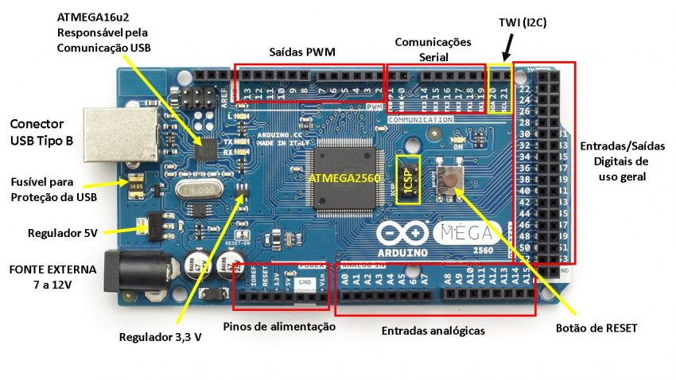
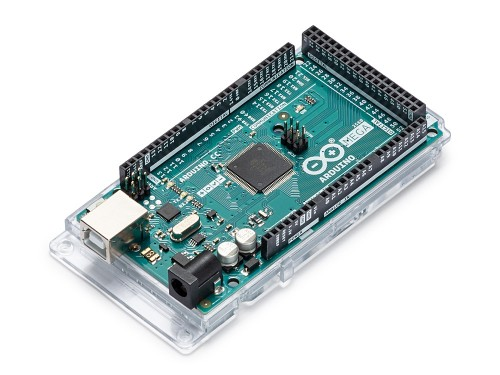

# Modelo ATMEGA2560

- Classificação: microcontrolador, placa Arduíno MEGA.
- Nome técnico: ATMEL ATMEGA2560
- Ano de lançamento:

A placa Arduino MEGA 2560 é uma ótima opção para expandir seus projetos, quando há a necessidade de mais pinos ou quantidade de memória FLASH. Pode ser aplicada em automação residencial, robótica e em vários projetos eletrônicos que necessitem de muitos pinos digitais ou analógicos.

## Características

Baseada no microcontrolador ATMEGA2560, possui 54 pinos de entradas e saídas digitais onde 15 destes podem ser utilizados como saídas PWM. Possui 16 entradas analógicas, 4 portas de comunicação serial. Além da quantidade de pinos, ela conta com maior quantidade de memória que Arduino UNO, sendo uma ótima opção para projetos que necessitem de muitos pinos de entradas e saídas além de memória de programa com maior capacidade.

### Arquitetura

O microcontrolador utilizado na Arduino MEGA 2560  é o ATMEL ATmega2560, um microcontrolador de 8 bits de arquitetura RISC avançada. Esse microcontrolador possui mais recursos comparado ao ATmega328 da Arduino UNO. Ele conta com 256 KB de Flash (mais 8 KB são utilizados para o bootloader), 8 KB de RAM e 4 KB de EEPROM. Chega 16 MIPS, operando em 16 MHz. Possui multiplicador por Hardware e diversos periféricos que aumentam as possibilidades da plataforma Arduino baseada em Atmel ATMEGA, dentre as quais pode-se destacar 4 canais de comunicação serial, 16 entradas analógicas e 15 saídas PWM. Possui ainda comunicação SPI, I2C e 6 pinos de interrupções externas.

### Conjunto de instruções

### CPU

- Clock: 16 MHz

### GPU

Não possui GPU.

### Memória

| Tipo     | Tamanho |
| :---        |    :----:   |
| RAM   | 8KB       |
| Flash   | 256KB       |
| EEPROM   | 4KB       |

### GPIO

- Quantidade: 54
- Tipos: 5 destes podem ser utilizados como saídas PWM. Possui 16 entradas analógicas, 4 portas de comunicação serial.

### Recursos

- Conector USB tipo B.

## Fotos

## Referências

[Arduino Mega](https://store.arduino.cc/usa/mega-2560-r3)

[ATMega2560](http://ww1.microchip.com/downloads/en/DeviceDoc/Atmel-2549-8-bit-AVR-Microcontroller-ATmega640-1280-1281-2560-2561_datasheet.pdf)
