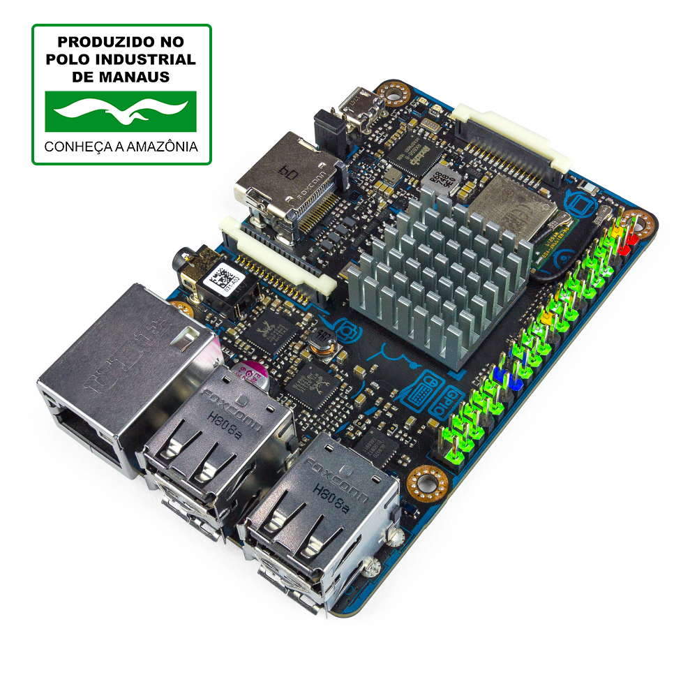
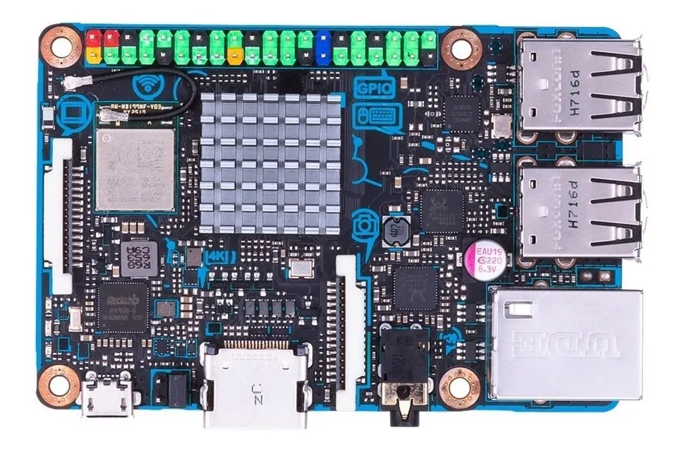

# Asus Tinker Board

- Classificação: Computador de Placa Única
- Nome técnico: Asus Tinker Board
- Ano de lançamento: 2017

Este computador de placa única da ASUS pode ser usado para demontração ou desenvolvimento de sistemas, para propósitos educacionais, ou como um computador embutido para controlar algum projeto.
Esta placa, em especial possui saída de vídeo em 4K, o que a torna interessante para projetos multi-mídia.

## Características

Semelhante ao Raspiberry Pi 3, possui tamanho semelhante a um cartão de crédito, e é rico em entradas e saídas para permitir utilização em diversos projetos.

### Arquitetura

ARMv7-A (32-bit).

### Conjunto de instruções

### CPU
ARM Cortex-A17

- Clock: 1,8GHz
- Cache:
  - L1: 32-64KiB de instruções, 32KiB de dados
  - L2: 256KiB - 8MiB
- Núcleos: 4

### GPU

ARM Mali GPU T760 MP4

- Clock: 600MHz
- Cache:
- Núcleos: 4

### Memória

- Tipo: Dual channel (canal duplo) LPDDR3
- Tamanho: 2GB

### GPIO

- Quantidade: Total 40
- Tipos:
  - GPIO: 28
  - SPI bus: 2
  - I2C bus: 2
  - UART: 2
  - PWM: 2
  - PCM/I2S: 1
  - Alimentação 5V: 2
  - Alimentação 3.3V: 2
  - Aterramento: 8
  - PWM: 1
  - PCM/I2S: 1

### Recursos

- Bluetooth: Bluetooth 4.0
- Rede: 802.11 b/g/n, Gbit LAN

## Fotos

## Referências

[Documentação no site da ASUS](https://www.asus.com/Single-Board-Computer/Tinker-Board/)
[FAQ da ASUS Tinker Board (ASUS)](http://dlcdnet.asus.com/pub/ASUS/mb/Linux/Tinker_Board_2GB/FAQ-Tinkerboard_20170425.pdf?_ga=2.238646848.1977487471.1497925364-1326992642.1492409882)
[Manual de Instruções](https://www.asus.com/Single-Board-Computer/Tinker-Board/HelpDesk_Manual/)