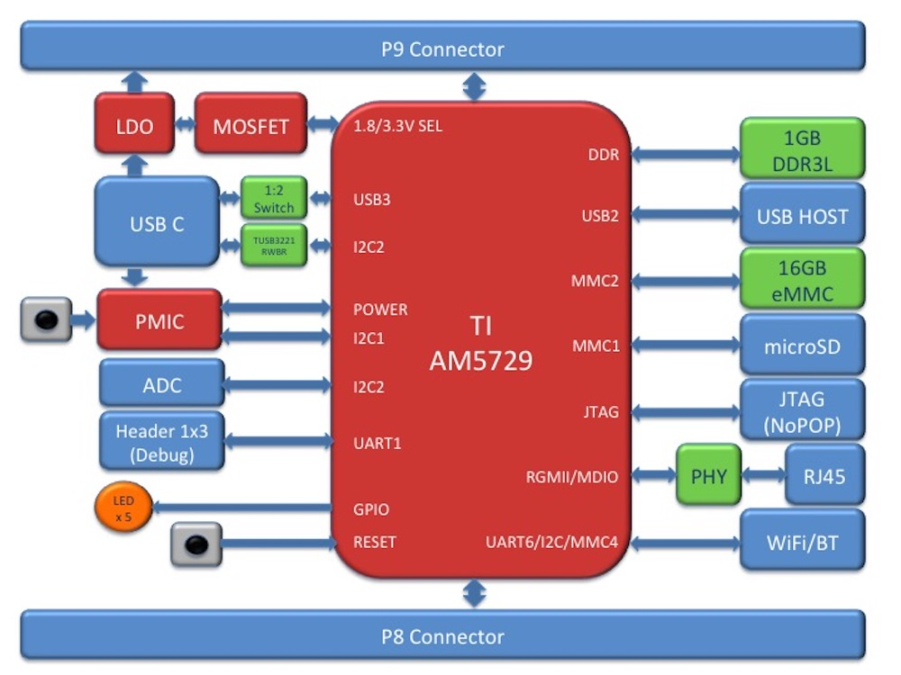
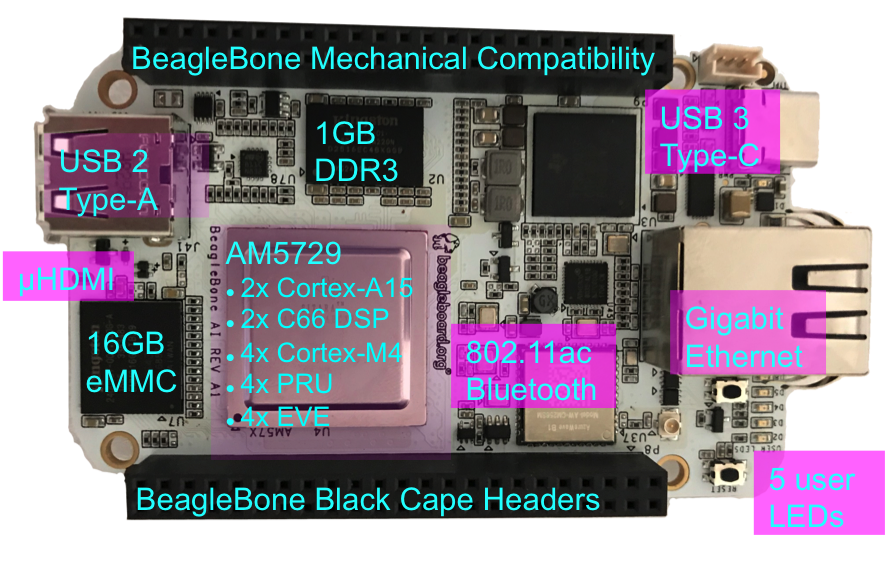

# BeagleBone AI

- Classificação: placa
- Nome técnico: BeagleBone® AI

Desenvolvido para ser uma solução intermediária, para a exploração de inteligência artificial. Possui embedded-vision-engine (EVE) cores, para problemas de visão computacional, e TI C66x digital-signal-processor (DSP) cores, para processamento de sinais digitais, e clama possuir softwares básicos já instalados.

### Conjunto de instruções

- Dual-core ARM® Cortex®-A15 RISC CPUs
- TI C66x VLIW floating-point DSP core
- Vision AccelerationPac (4x EVEs)

### CPU
Texas Instruments Sitara AM5729
- Clock: 1,5GHz
- Cache: 2,5MB
- Núcleos: 2

### GPU

Dual-Core PowerVR® SGX544™ 3D GPU
- Clock: 533MHz
- Cache: 128KB
- Núcleos: 3

### Memória

- Tipo: DDR3L
- Tamanho: 1GB (4x256MB)
- Clock: 533MHz

- Tipo: eMMC flash
- Tamanho: 16GB

### GPIO

- Quantidade: 67

### Recursos

- USB 3 Type-C
- USB 2 Type-A
- Gigabit Ethernet PHY
- WiFi: 802.11ac 2,4/5GHz (AzureWave AW-CM256SM)
- microSD
- microHDMI
- Bluetooth

## Fotos

## Referências

[BeagleBoard Ai](https://beagleboard.org/ai)
[Wiki](https://github.com/beagleboard/beaglebone-ai/wiki/System-Reference-Manual)
