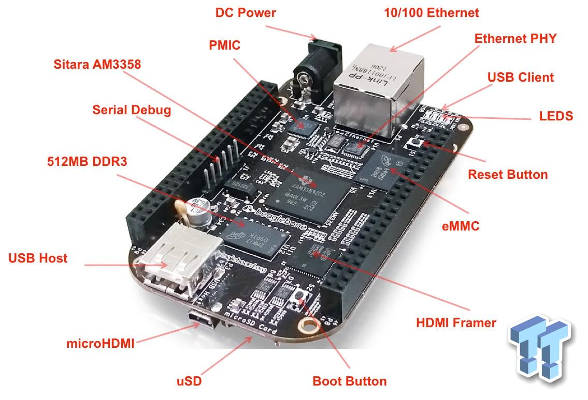
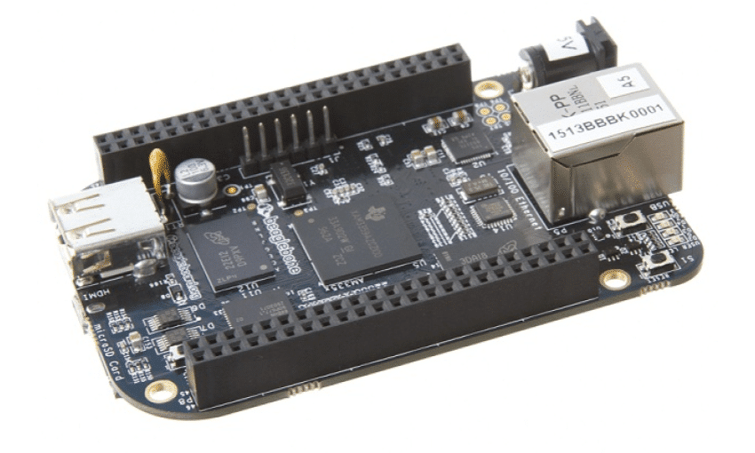

# BeagleBone Black (BBB01-SC-505)

- Classificação: microcontrolador
- Nome técnico: BBB01-SC-505
- Ano de lançamento: 2013

Este dispositivo é um computador de placa única que suporta sistemas operacionais linux e é um competidor do Raspberry Pi. Seu uso é recomendado para projetos um pouco mais complexos que não consigam usar apenas um Arduino. Além disso, uma vantagem sua é permitir a conexão de vários outros dispositivos hardware para I/O. Por isso, pode ser recomendado para projetos de IOT que usem vários sensores e necessitem processar dados.

## Características

### Arquitetura

- CPU Sitara AM3358BZCZ100 (ARM Cortex A8)
- GPU PowerVR SGX530
- Memória RAM Micron 512MB DDR3L 
- Memória Flash 4GB
- Conectores MicroSD
- USB 2.0
- Interface HDMI

### Conjunto de instruções

RISC - SIMD (Single Instruction, Multiple Data)

### CPU

- Clock: 600 MHz - 1 GHz
- Cache: 32KB L1, 256KB L2  
- Núcleos: 1 (ARM Cortex A8)

### GPU

- Clock: 200 MHz
- Cache: Informação não encontrada
- Núcleos: Informação não encontrada

### Memória

- Tipo: DDR3
- Tamanho: 512MB

### GPIO

- Quantidade: 69 pins
- Tipos: Informação não encontrada

### Recursos

- Bluetooth: Não possui
- Rede: Ethernet
\* (existe a versão BeagleBone Black Wireless que possui Bluetooth e Wi-fi)

## Fotos

## Referências

[Datasheet](https://media.digikey.com/pdf/Data%20Sheets/Circuitco%20Elect/BB-BBLK-000%20Manual.pdf)
[Beagleboard](https://beagleboard.org/black)
[Wikipedia](https://en.wikipedia.org/wiki/BeagleBoard)
[Ti.com](https://www.ti.com/product/AM3358)
