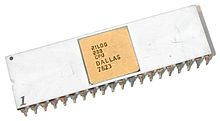

# Modelo (Atmega 328, Broadcom, Arduino UNO Rev 3, Raspberry Pi B+)

- Classificação: microprocessador, microcontrolador, placa
- Nome técnico:
- Ano de lançamento:

Este dispositivo faz isso, serve para isso, pode ser bom para isso, etc.

## Características

### Arquitetura

### Conjunto de instruções

### CPU

- Clock:
- Cache:
- Núcleos:

### GPU

- Clock:
- Cache:
- Núcleos:

### Memória

- Tipo:
- Tamanho:

### GPIO

- Quantidade:
- Tipos:

### Recursos

- Bluetooth:
- Rede:

## Fotos

## Referências

[Google](http://google.com)
