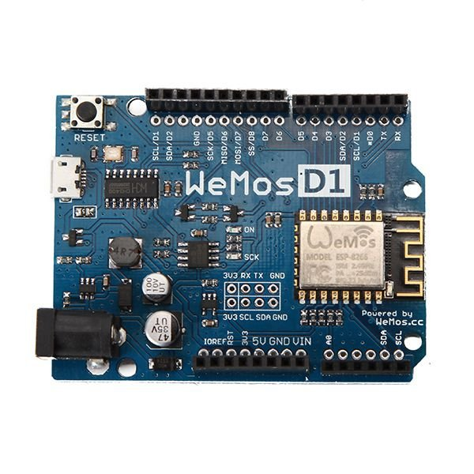

# ESP8266 Wemos D1 R2

- Classificação: placa de desenvolvimento com microcontrolador
- Nome técnico: Wemos D1 R2
- Ano de lançamento: ~2015 [BR-ARDUINO.ORG]

A placa de desenvolvimento Wemos D1 R2 possui formato físico parecido com o Arduino Uno (dimensões 70 x 53,5 x 12,5 mm) [TECNOTRONICS], com conector micro USB, com ESP8266-12E integrado. Possui WiFi nativo.

## Características

### Arquitetura

Arquitetura RISC de 32 bits.

### Conjunto de instruções

Comandos AT para interface com memória, teste, reinício, sleep mode, WiFi e TCP/IP. Conjunto completo disponível em [ESP8266 AT INSTRUCTION SET].

### CPU

- Clock: de 80 a 160 MHz (ajustável)
- Cache: N/A
- Núcleos: 1

### GPU

- Clock: N/A
- Cache: N/A
- Núcleos: N/A

### Memória

- Tipo: Flash
- Tamanho: 4MB de memória

### GPIO

- Quantidade: 11 pinos digitais, 1 analógico (conversor A/D de 10 bits)
- Tipos: pinos digitais possuem suporte a interrupção, PWM, I2C
- Tensão de Operação: 3,3V

### Recursos

- Bluetooth: Não há
- Rede: WiFi nativo 802.11b/g/n. com modos de operação AP, Station ou AP+Station. Suporta WPA2, IPv4, TCP, UDP, HTTP
- Programação: suporta OTA (Over The Air), ou pela USB. Compatível com Arduino IDE.

### Alimentação

- 5V pelo conector micro USB, de 9 a 24 V pelo pino jack

## Fotos

## Referências

[BR-ARDUINO.ORG](https://br-arduino.org/2016/02/wemos-d1-versao-2-atualizacao-do-uno-com-esp8266-ja-tem-clones-no-dx.html)

[TECNOTRONICS](https://www.tecnotronics.com.br/placa-esp8266-arduino-wemos-d1.html)

[!ESP8266 AT INSTRUCTION SET](https://ucc34e8710307db6741afb81a60e.dl.dropboxusercontent.com/cd/0/inline2/A_oMZeYEVzwHSn8w3HJv_4LTdMBnoWNKLE_y4S-fRbHIjW6olauwJgu4kwMO7lBGscfnOD3tr-EKGl1icEIZ-3Sf_Q6lrv9vX8vCqMAcfIAmwkmNktJNko9srnMCZwNU7NQI9NtjqO3X6FNtDC4ZqSlkQueW_16VacvDlLi3ZowaKvqfH-pDy1F2S2-sQway254BMIfOMZdZ9y7pEs3thQomCclZbI0mnS2IZ0eshqOayoidUvMC4AF_kR_-44iOaM_jvG5I88XxX7Tz0gRaN2ncgiprWRB6NJQI0KgZbdE-nHxz08lqdLqrq-IgcIZONVzr_-haspO1B8TNU8zMpchD/file#)

[!ESP8266 TECHNICAL REFERENCE](https://uc264c5246d25218645169b3fa29.dl.dropboxusercontent.com/cd/0/inline2/A_r52DyEKEEM-EOv42h7RXX-dsE7y3YjUtGsUfAOstto6yRic1YWQ6WqxDD9ucuVGQK5YTmZ4hHWZt9hRU-uH-M5xCDIq3Gja7vU0ODbCLHZ7oYjZGaBo9TgKd8a83-4t7n5JSHwOtdtmZAW6VVjNCmb3kSySOMo48ShChk6ORbtkqIaRwWAGQxzA4o6-OG5HIMv4KFsB91Kdmjiyr21mg_10EDmseVH-m1Au5zrdPqKG76Mng-5ueAgMfycbfDdXvsGrY99wqIn3129KqJkP3f3l52nOfVnWMiU67uioTHD6PX9nUcgIldf-JwVXZAxZeJp2uNqNUJIowo402H2wiL5/file#)

[!ESP8266 DATASHEET](https://uc72b699a2cf8581a54fa3a7d53f.dl.dropboxusercontent.com/cd/0/inline2/A_oKraogTxbOgUFgIkXU9qPoHeMAa7K9JOTeyoYqt_c--1t5WUYH6Fq8yHMN4ESbXNETDcPyO730kLOHFZeRq6G95MAKBv0F0YA8ljC84EIPee2gu52RAIFjSo4HUNmivSw2UkHL5pmVkhLYNdpCgjAhljWFiCAnhXBkmeaLKsD2zTR6MGjRZ-QdwdQH8qLGYZe4j2oZ0V2Jip0La23g0Gb5xqbEAwJ1yCmjehuQPCF1u_0WzTIAdrZBs3VqoVos_PDiMEFvDKG_U9wl4-acYtuXulWg3d_3JpPx_16HeriOMr0OLxacrIhStbFQsSYk7UyRhtdPbM-7A2hvSQ7UDvOZ/file#)
