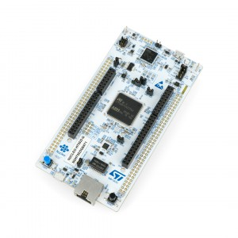

# NUCLEO-H755ZI-Q

- Classificação: Núcleo board - Microcontrolador
- Nome técnico: NUCLEO-H755ZI-Q
- Ano de lançamento: 15/02/2017

A familía STM32H7 é a mais poderosa de microcontroladores de 32 bits baseados em núcleos ARM Cortex-M, dentro de todas populares e oferecidas pela ST Microelectronics.
Essa placa de alta performance, é tão rápida e oferece tantos recursos avançados que começa a confundir a linha entre o microcontrolador e o microprocessador. Com ela é possível trabalhar em projetos com IA, automotiva e dentre outros que exigem velocidades de processamento rápidos.

## Características

Essa placa possuí dois nucleos de alto desempenho, sendo um Arm Cortex M7 de 480MHz e outro Cortex M4 240MHz.

### Arquitetura

Ambos núcleos da placa são baseados na arquitetura Harvard.

### Conjunto de instruções

Instruções RISC.

### CPU

Cortex M7:
- Clock: até 480MHz
- Cache: Cache L1 de 16 Kbytes de dados e 16 Kbytes de cache de instruções

Cortex M4:
- Clock: até 240MHz
- Cache: N/A

### GPU

N/A

### Memória

- Memória Flash:
- Tamanho: 2MBytes

- Memória RAM:
- Tamanho: 1MBytes
(92 Kbytes de TCM RAM (incluindo 64 Kbytes de ITCM RAM + 128 Kbytes de DTCM RAM para rotinas de tempo crítico), 864 Kbytes de SRAM do usuário e 4 Kbytes de SRAM no domínio de backup)

- Interface de memória Quad-SPI de modo dual rodando até 133 MHz
- Controlador de memória externa flexível com barramento de dados de até 32 bits: SRAM, PSRAM, SDRAM / LPSDR SDRAM, memória Flash NOR / NAND com clock de até 125 MHz no modo síncrono
- Unidade de cálculo CRC

### GPIO

144 portas de entradas e saídas, todas com suporte para interrupção. Cada pino é programavel, podendo encontrar os seguintes recursos:

- I2C, SPI, USART/UART/LPUART, SAIs, CAN, USB OTG, ADC, DAC e entre outros...

### Recursos

- 4 × interfaces I2Cs FM + (SMBus / PMBus)
- 4 × USARTs / 4x UARTs (interface ISO7816, LIN, IrDA, até 12,5 Mbit / s) e 1x LPUART
- 6 × SPIs, 3 com precisão de classe de áudio I2S duplex multiplexado via PLL de áudio interno ou relógio externo, 1x I2S no domínio LP (até 150 MHz)
- 4x SAIs (interface de áudio serial)
- Interface SPDIFRX
- SWPMI single-wire protocol master I / F
- Interface MDIO Slave
- 2 × interfaces SD / SDIO / MMC (até 125 MHz)
- 2 × controladores CAN: 2 com CAN FD, 1 com CAN acionado por tempo (TT-CAN)
- 2 × interfaces USB OTG (1FS, 1HS / FS) solução sem cristal com LPM e BCD
- Interface Ethernet MAC com controlador DMA
- HDMI-CEC
- Interface de câmera de 8 a 14 bits (até 80 MHz)
- 3 × ADCs com máx. De 16 bits. resolução (até 36 canais, até 3,6 MSPS)
- Conversores D / A de 2 × 12 bits (1 MHz)
- 2 × comparadores de energia ultrabaixa
- 2 × amplificadores operacionais (largura de banda de 7,3 MHz)
- 1 × filtro digital para modulador sigma delta (DFSDM) com 8 canais / 4 filtros

## Fotos

## Referências

- [ST - Nucleo](https://www.st.com/en/evaluation-tools/nucleo-h755zi-q.html)
- [Datasheet - Nucleo](https://www.st.com/resource/en/user_manual/dm00499171-stm32h7-nucleo144-boards-mb1363-stmicroelectronics.pdf)
- [ST - Chip](https://www.st.com/en/microcontrollers-microprocessors/stm32h755zi.html)
- [Reference Manual](https://www.st.com/resource/en/reference_manual/dm00176879-stm32h745755-and-stm32h747757-advanced-armbased-32bit-mcus-stmicroelectronics.pdf)
