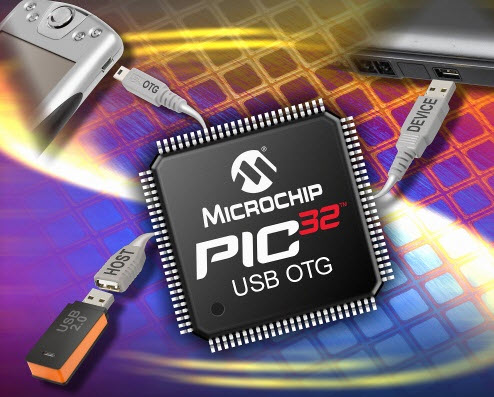

# Modelo (PIC32 MX)

- Classificação: Microcontrolador
- Nome técnico: PIC32MX110F016B
- Ano de lançamento: 2011

O PIC32MX110F016B faz parte da família de microcontroladores PIC32, fabricados pela Microchip.

São usados tanto por desenvolvedores de sistemas embarcados industriais quanto hobistas devido ao seu baixo custo, alta disponibilidade, ferramentas de desenvolvimento gratuitas e grande base de usuários. 

## Características

### Arquitetura

Arquitetura Harvard: possui memória separada para dados e programas

### Conjunto de instruções

MIPS32 Enhanced Architecture (RISC)

### CPU

- Clock: 40 MHz
- Cache: N/A
- Núcleos: 1

### GPU

- Clock: N/A
- Cache: N/A
- Núcleos: N/A

### Memória

- Tipo: Flash (memória de programa)
- Tamanho: 16KB

- Tipo: SRAM
- Tamanho: 4KB

- Tipo: Flash (auxiliar)
- 3 KB

### GPIO
- Quantidade: 21 pins
- Tipos: UART, I2C, I2S, SPI, GPIO, ADC

### Recursos

- Bluetooth: Não possui
- Rede: 10/100 Ethernet

## Fotos

## Referências

- [Wikipedia](https://en.wikipedia.org/wiki/PIC_microcontrollers#PIC32M_MIPS-based_line)
- [Microchip](https://www.microchip.com/wwwproducts/en/PIC32MX110F016B#additional-features)