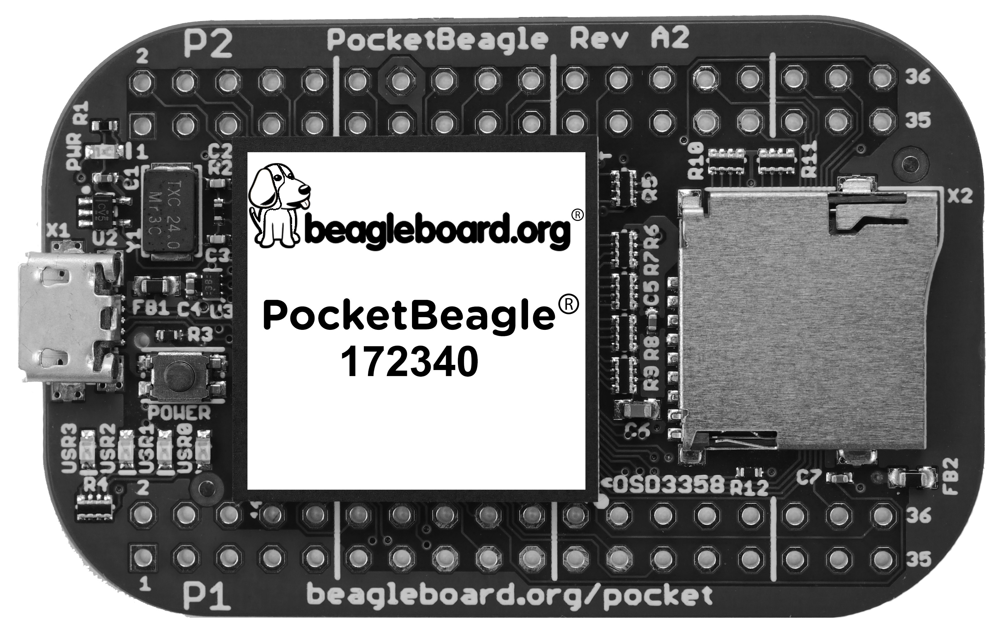
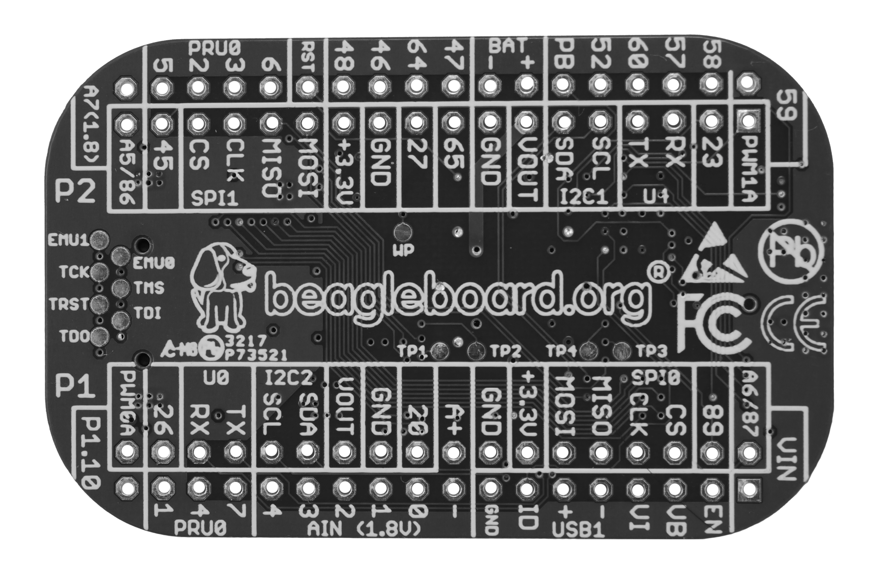
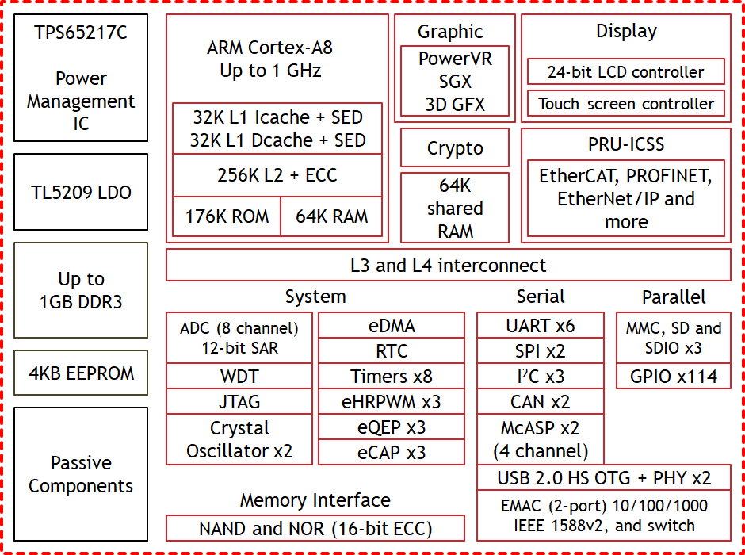

# PocketBeagle

- Classificação: Placa (microcomputador com microprocessador)
- Nome técnico: PocketBeagle
- Ano de lançamento: 2017

PocketBeagle é um microcomputador de arquitetura ARM capaz de rodar linux e programas complexos. Ele é, na verdade, uma versão em miniatura do [BeagleBone Black](BeagleBone_Black.md) cuja miniaturização veio a custo da redução no número de interfaces de comunicação. Devido ao seu tamanho reduzido mas processamento robusto é aconselhável para aplicações de robótica, como drones, ou videogames portáteis.

Devido a falta de interfaces de comunicação de rede, se faz necessário o uso de módulos extras para aplicar essa placa à áreas de IoT ou computação vestível, onde seu tamanho reduzido se torna especialmente importante.

## Características

### Arquitetura
ARM 32 bits

### Conjunto de instruções
RISC

### Módulo de Processamento:
##### Octavo Systems OSD3358 1GHz ARM Cortex-A8:
#### CPU
##### Sitara AM3358 ARM Cortex-A8 
- Clock: 1 GHz
- Cache:
  - L1: 32 KB com 32 KB de detecção de erros (paridade)
  - L2: 256 KB ECC
  - L3: 64 KB
- Núcleos: 1

#### GPU
##### SGX530 3D Graphics Engine 
- Clock: 200 MHz
- Cache: N/A
- Núcleos: 2 pixel e 1 vertex shaders

### Memória
#### RAM
- Tipo: DDR3 800 MHz
- Tamanho: 512 MiB

#### ROM
- Tipo: I2C EEPROM
- Tamanho: 4 KB

### GPIO

- Quantidade: 8 de entrada analógica e 44 digitais dos quais:
  - 3 UARTs;
  - 2 I2C;
  - 2 SPI;
  - 4 PWM;
  - 2 QEP;
  - 2 CAN;

### Recursos

- Conector micro USB 2.0 OTG
- Slot MicroSD (até 128 GB)
- Emulação JTAG
- Bluetooth: Não possui.
- WiFi: Não possui.
- Rede:  Não possui.

## Fotos

## Referências

[Manual](https://github.com/beagleboard/pocketbeagle/wiki/System-Reference-Manual)

[GPU](https://en.wikipedia.org/wiki/PowerVR#Series5_(SGX))

[CPU](https://www.ti.com/lit/ds/symlink/am3358.pdf?ts=1600798333233&ref_url=https%253A%252F%252Fwww.ti.com%252Fproduct%252FAM3358)
