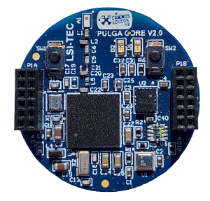

# Pulga Core

- Classificação: placa microcontroladora
- Nome técnico: Pulga Core V2.0
- Ano de lançamento: 2019

Placa microcontrroladora de tamanho reduzida ideal para criação de redes inteligentes, sensoriamento, computação de borda e aplicações de IoT.

## Características
Sensor de 9 eixos (Giroscópio, Acelerometro, Magnetometro)
Sensor de ambiente (Temperatura, Humididade, Pressão)

### Arquitetura
ARMv7-ME

### Conjunto de instruções
Thumb (total)
Thumb-2 (total)
Multiplicador de hardware de 1 ciclo (32-bit), divisão de hardware de 2-12 ciclos (32-bit)
Extensão DSP: 16/32-bit MAC de único ciclo, 16-bit MAC duplo de único ciclo, aritmética 8/16-bit SIMD.
Extensão de ponto flutuante (silicon option): Unidade de ponto flutuante de precisão simples, chamada FPv4-SP.

### CPU

- Clock:1.5GHz
- Cache: 32kb data + 48kb instruções L1 - 1mb L2
- Núcleos: 4

### GPU
Não tem

### Memória
- Tipo: Não informado
- Tamanho: 256kB

### GPIO
- Quantidade: 24
- Tipos: I/O pins

### Recursos

- Bluetooth: Bluetooth 5.0 - Bluetooth Mesh

## Fotos

## Referências

https://pt.wikipedia.org/wiki/ARM_Cortex-M
https://www.telesintese.com.br/cachorros-loucos-querem-revolucionar-o-ecossistema-brasileiro-de-iot/
https://caninosloucos.org/pt/pulga-v2-pt/