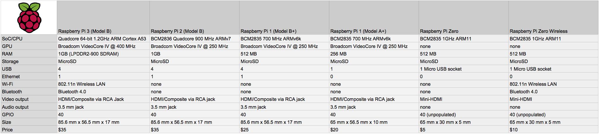

# Modelo (Raspberry Pi Zero W)

- Classificação: It is a single board computer
- Nome técnico: Raspberry Pi Zero W
- Ano de lançamento: 2017

#### The main difference with other versions is that Raspberry Pi Zero W Adds Wi-Fi and Bluetooth to the Zero

The Raspberry Pi Zero W is the smallest and cheapest Raspberry Pi computer. It's an incredibly tiny piece of equipment, but still capable of running the same Raspbian OS (based on Linux) as every other Raspberry Pi computer. With built in wireless LAN and Bluetooth, plus a mini-HDMI and micro-USB connector enables a range of input / output options. A built in CSI camera interface enables you to quickly add a camera module.

## Características

Dimensions: 65mm × 30mm × 5mm

### CPU

SoC: Broadcom BCM2835

CPU: ARM11 running at 1GHz

### GPU
Videocore IV

### Memória

RAM: 512MB

Storage: MicroSD card

### GPIO

GPIO: 40-pin GPIO, unpopulated

### Recursos

Wireless: 2.4GHz 802.11n wireless LAN

Bluetooth: Bluetooth Classic 4.1 and Bluetooth LE

### More

Pins: Run mode, unpopulated; RCA composite, unpopulated

Camera Serial Interface (CSI)

Power: 5V, supplied via micro USB connector

Video & Audio: 1080P HD video & stereo audio via mini-HDMI connector

Output: Micro USB

## Fotos

Comparing Zero w with other versions

## Referências

[lifehacker](https://lifehacker.com/the-raspberry-pi-zero-wireless-adds-wi-fi-and-bluetooth-1792789503)

[magpi](https://magpi.raspberrypi.org/articles/raspberry-pi-specs-benchmarks)

[androidauthority](https://www.androidauthority.com/raspberry-pi-zero-w-review-756498/)

[robu](https://robu.in/product/raspberry-pi-zero-wireless-wh-pre-soldered-header/)

