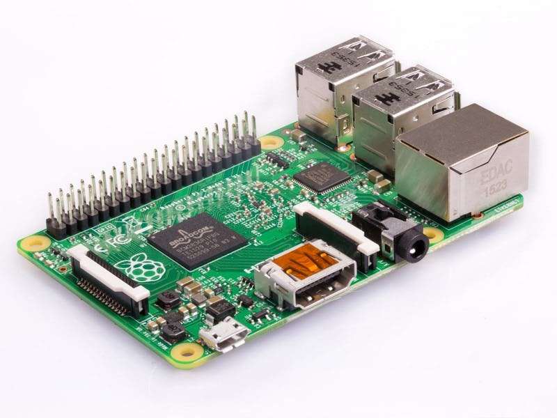
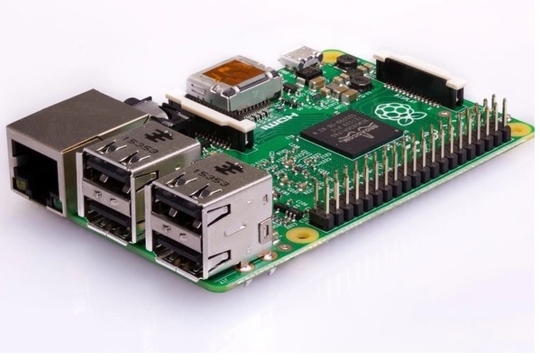

# Raspberry Pi 2 Model B

- Classificação: Placa/Microcomputador (que contém um microprocessador)
- Nome técnico: Raspberry Pi 2 Model B
- Ano de lançamento: 2015

Este dispositivo foi projetado inicialmente para ser uma opção tecnicamente acessível e de baixo custo para ensinar crianças a programarem. Porém, com o tempo, várias outras aplicações foram sendo encontradas, como robótica, monitoramento de clima, experimentos científicos, projetos musicais, videogames e muito mais.

## Características

### Arquitetura

ARMv7-A (RISC)

### Conjunto de instruções

ARMv7-A (32-bit)

### CPU

4x Cortex-A7

- Clock: 900 MHz
- Cache:
  - L1: 8–64 KB/8–64 KB
  - L2: Optional, up to 1 MB

- Núcleos: 1–8

### GPU

Broadcom VideoCore IV

- Clock: 250 MHz
- Cache: Não encontrado
- Núcleos: Não encontrado

### Memória

- Tipo: SDRAM
- Tamanho: 1GB

### GPIO

- Quantidade: 40 pinos
- Tipos: Não encontrado

### Recursos

- Bluetooth: Não possui.
- WiFi: Não possui.
- Rede: Ethernet 10/100 Mbit/s

## Fotos

## Referências

[Wikipedia Article](https://en.wikipedia.org/wiki/Raspberry_Pi)

[Official Site](https://www.raspberrypi.org/products/raspberry-pi-2-model-b/)

[Official FAQ](https://www.raspberrypi.org/documentation/faqs)
