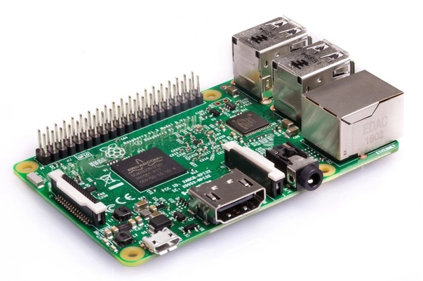
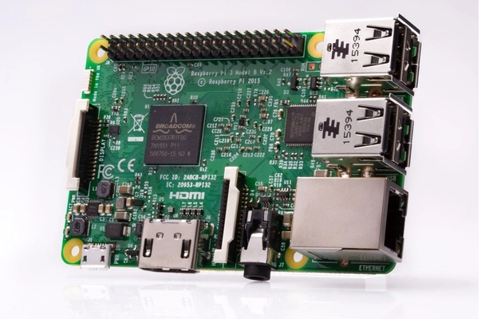

# Modelo (Raspberry Pi 3 B)

- Classificação: placa
- Nome técnico: Raspberry Pi 3 B
- Ano de lançamento: 2016

É a terceira geração da linha de placas que foram um dispositivo compacto (em tamanho similiares a um cartão bancário) que entregam um mini PC de baixo custo,  que pode ser utilizados para os mais variados projetos, despertando mais interesse nos desenvolvedores de softwares livres.    O sistema Operacional fica instalado no cartão micro SD.  

## Características:  

### Arquitetura: ARM

### Conjunto de instruções: ARMv6

### CPU

- Clock: 	1.2 GHz - Cortex-A53 64-bit - Broadcom BCM2837
- Cache:  32kB Level 1 and 512kB Level 2
- Núcleos: 4

### GPU

- Clock: 400 MHz
- Cache: 
- Núcleos: 2

### Memória

- Tipo: DDR2
- Tamanho: 1 GB

### GPIO

- Quantidade: 40
- Tipos: 

### Recursos

- Bluetooth: 4.2
- Rede: Ethernet 10/100 Mbit/s  e WIFI 2,4 GHz/ 5 GHz IEEE 802.11 802.11 - BCM43438

## Fotos

## Referências

[1-WIKIPEDIA](https://pt.wikipedia.org/wiki/Raspberry_Pi)

[2-WIKIPEDIA](https://en.wikipedia.org/wiki/Raspberry_Pi_Foundation)

[3-RASPEBERRYPI.ORG](https://www.raspberrypi.org/products/raspberry-pi-3-model-b/)

[4-RASPEBERRYPI.ORG](https://www.raspberrypi.org/documentation/usage/gpio/)

