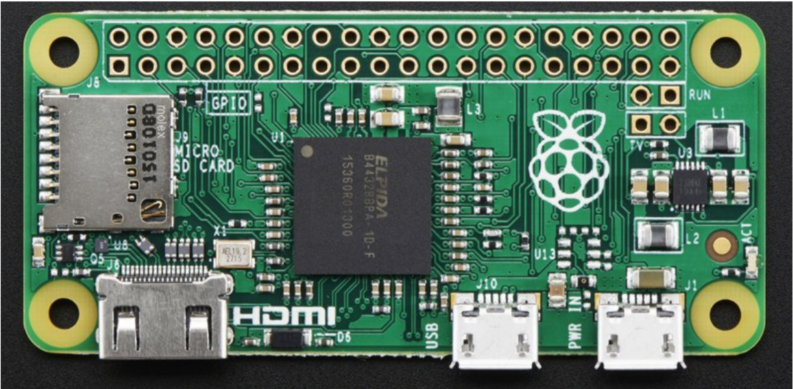
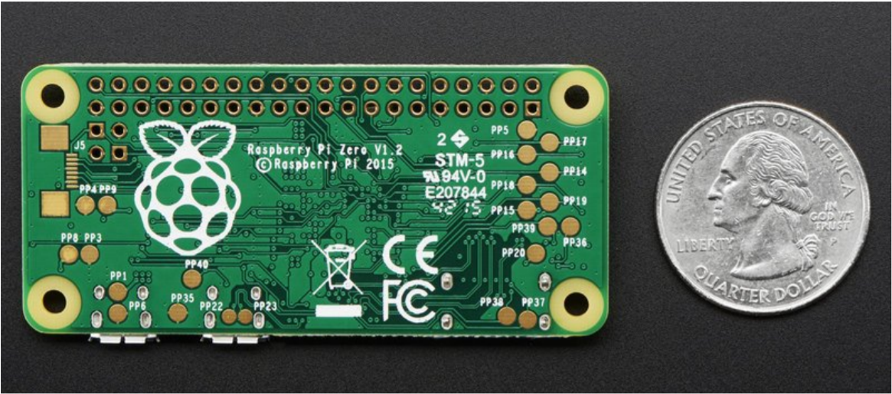
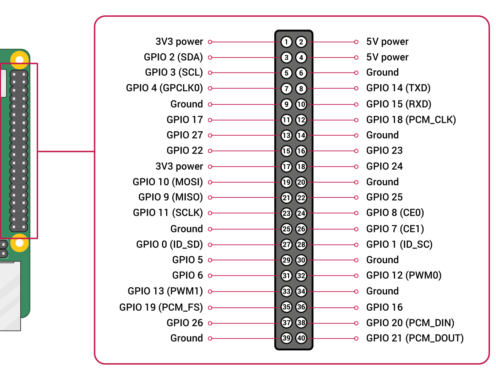

# Raspberry Pi Zero

- Classificação: Microcomputador
- Nome técnico: Raspberry Pi Zero
- Ano de lançamento: 2015

O Rasperry Pi Zero é um microcomputador de placa única, pequeno e de baixo custo, capaz de se conectar a uma TV ou monitor e utilizar um teclado e um mouse USB. Ele foi desenvolvido para o ensino da Ciência de Computação em escolas, inclusão digital e projetos de automação, casas inteligentes e Internet das coisas. 

## Características

- Comprimento: 65mm
- Largura: 30mm
- Espessura: 5mm

### Arquitetura

Utiliza uma arquiteturra SOC (System-On-Chip), em português sistema-em-um-chip. O processador, a placa de vídeo e a memmória RAM estão embutidos em um chip.

- Chip: Broadcom BCM2835 SOC 

### Conjunto de instruções

### CPU

ARM1176JZF-S RISC

- Clock: 1GHz
- Cache: n/a
- Núcleos: 1

### GPU

Broadcom VideoCore IV

- Clock: 250MHz
- Cache: n/a
- Núcleos: n/a

### Memória

- Tipo: SDRAM
- Tamanho: 512MB

### GPIO

- Quantidade: 40 pinos
- Tipos: Detalhado no diagrama

PWM (pulse-width modulation)
- Software PWM available on all pins
- Hardware PWM available on GPIO12, GPIO13, GPIO18, GPIO19

SPI
- SPI0: MOSI (GPIO10); MISO (GPIO9); SCLK (GPIO11); CE0 (GPIO8), CE1 (GPIO7)
- SPI1: MOSI (GPIO20); MISO (GPIO19); SCLK (GPIO21); CE0 (GPIO18); CE1(GPIO17); CE2 (GPIO16)

I2C
- Data: (GPIO2); Clock (GPIO3)
- EEPROM Data: (GPIO0); EEPROM Clock (GPIO1)

Serial
- TX (GPIO14); RX (GPIO15)

### Recursos

- Micro USB dados: 1 (On-The-Go)
- Micro USB alimentação: 1
- Mini HDMI: 1
- LED: 1 verde

## Fotos

## Referências

[Adafruit - Introducing Raspberry Pi Zero](https://cdn-learn.adafruit.com/downloads/pdf/introducing-the-raspberry-pi-zero.pdf)

[Raspberry Pi Full pin functions](https://meanderingpi.com/board-connections/)

[GPIO](https://www.raspberrypi.org/documentation/usage/gpio/)

[BCM2835 ARM Peripherals](https://www.raspberrypi.org/documentation/hardware/raspberrypi/bcm2835/BCM2835-ARM-Peripherals.pdf)

[VideoCore IV 3D](https://docs.broadcom.com/doc/12358545)