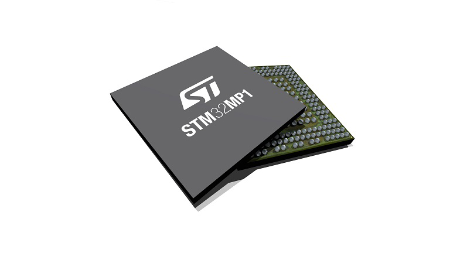
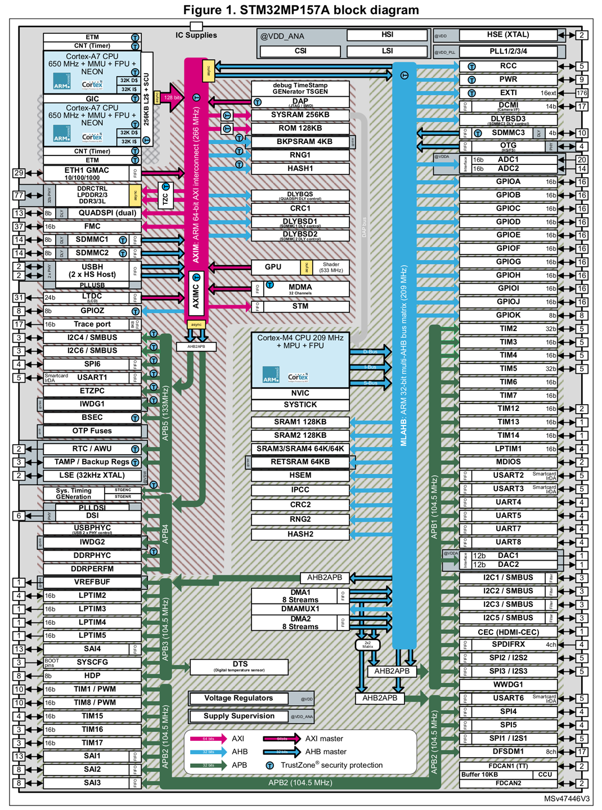

# STM32MP157A

- Classificação: Micro-processador
- Nome técnico: STM32MP157A
- Ano de lançamento: 08/08/2019

O dispositivo é um microprocessador. Pode ser usado em aplicações de IoT que necessitem de um sistema operacional completo.

### Arquitetura
Harvard - 32-bit

### Conjunto de instruções
ARM (RISC)

### CPU
Dual-core Cortex-A7 FPU Neon TrustZone

- Clock: até 650 MHz
- Cache: 2 caches L1 para dados de 32 Kbytes, 2 caches L1 para instruções de 32 Kbytes e um cache L2 256-Kbyte para coerência unificada.
- Núcleos: 2

### GPU
Vivante - Open GL ES 2.0
- Clock: 533 MHz
- Cache: (não encontrado)
- Núcleos: (não encontrado)

### Memória

- Tipo: SRAM embarcarda
- Tamanho: 708 Kbytes 

### GPIO

- Quantidade: Até 176 portas de entrada/saída com capacidade de interrupção.
- Tipos: até 8 entradas/saídas seguras, até 6 para Wakeup, 3 para Tamper, 1 para Active-Tamper.

### Recursos

- Bluetooth: (não encontrado, acredito que não possui)
- Rede: Gigabit Ethernet MAC interface (ETH1).

## Fotos

## Referências

[STMicroelectronics](https://www.st.com/en/microcontrollers-microprocessors/stm32mp157.html#)

[Farnell - datasheet](http://www.farnell.com/datasheets/2785304.pdf)

[STMicroelectronics - Manual de referêcia para desenvolvedores](https://www.st.com/resource/en/reference_manual/DM00327659.pdf)
