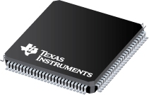

# Stellaris LM3S8938 Microcontroller

- Classificação: Microcontrolador
- Nome técnico: LM3S8938
- Ano de lançamento: 2006

Este microcontrolador da família Stellaris é capaz de atingir alto desempenho computacional de 32 bits por um custo equivalente a disponsitivos que suportam apenas 8 ou 16 bits. É adequado para aplicações que exigem tal performance por baixo custo.

## Características

### Arquitetura

ARM® Cortex™-M3 v7M de 32 bits (Harvard architecture).

### Conjunto de instruções

ARM Thumb-2 mixed 16-/32-bit.

### CPU

- Clock: 50MHz
- Cache: N/A
- Núcleos: 1

### GPU

- Clock: N/A
- Cache: N/A
- Núcleos: N/A

### Memória

- Tipo: Flash
- Tamanho: 256Kb

- Tipo: SRAM
- Tamanho: 64Kb

### GPIO

- Quantidade: 3 - 38, dependente da configuração
- Tipos: 5-V-tolerant para entrada e saída

### Recursos

- Bluetooth: N/A
- Rede: N/A

## Foto

## Referências

- [Original datasheet](https://www.alldatasheet.com/datasheet-pdf/pdf/354994/TI/LM3S8938.html)
- [ARM Cortex M3 Overview](https://www.ic.unicamp.br/~celio/mc404-2014/docs/cortex-m3-overview-Yiu_Ch2.pdf)
- [ARM and Thumb-2 Instruction Set Reference Guide](https://www.lri.fr/~de/ARM.pdf)