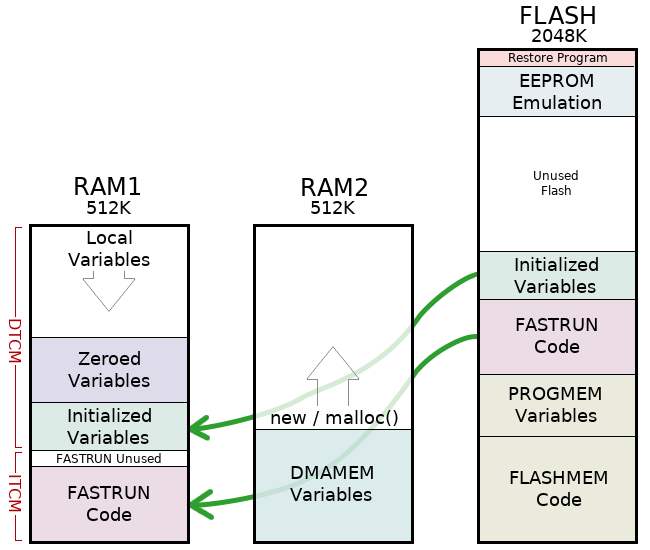
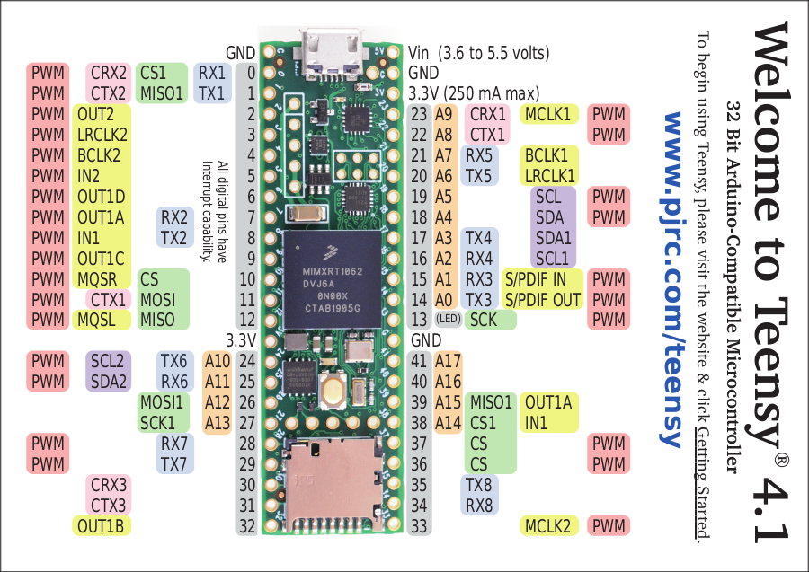
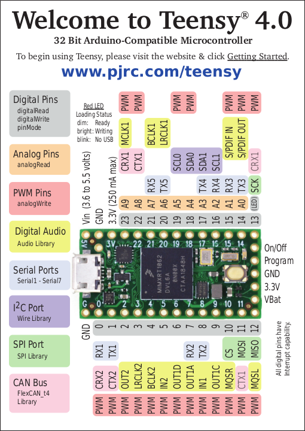
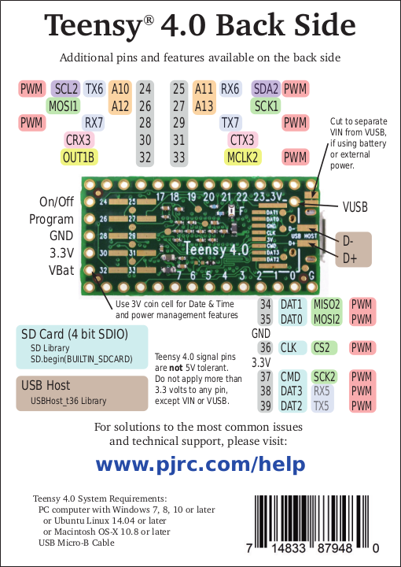
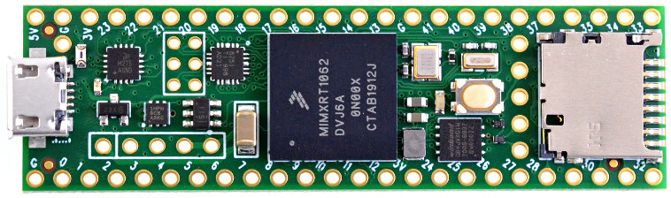
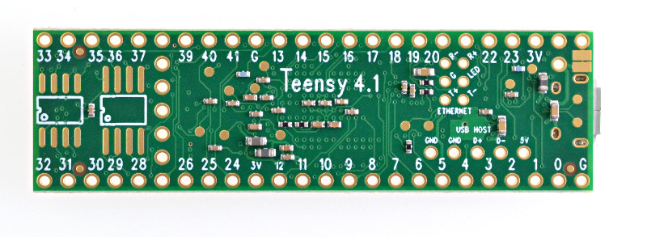

# Teensy 4.1

- Classificação: placa com microcontrolador/microcontrolador
- Nome técnico: Teensy 4.1
- Ano de lançamento: 2020

Teensy 4.1 é uma placa de desenvolvimento produzida pela empresa [PJRC](https://www.pjrc.com/) que serve como extensão da placa Teensy 4.0, com a adição de novos componentes e expansão dos já existentes. Como o seu antecessor, essa é uma placa que se utiliza de um microcontrolador para realizar computação principalmente em sistemas embarcados (assim como as placas da Arduino). Pode-se considerar essa placa como uma ótima opção intermediária para aqueles que querem transicionar do ecossistema do Arduino, visto sua compatibilidade com as funcionalidades das placas Arduino, com suporte completo da Arduino IDE, permitindo que códigos desenvolvidos para placas Arduino sejam portadas para essas placas sem muitas modificações.

As placas Teensy 4.1 e Teensy 4.0 são robustas em diversos aspectos. Deles, os que mais se destacam são a sua enorme velocidade de processamento de dados, possuindo um dos microcontroladores mais rápidos atualmente (e o mais rápido quando foi lançado o modelo 4.0, em 2019), e o seu baixo consumo de energia, mesmo quando executando na frequência máxima do clock. Devido a essas características, essas placas poderiam ser usadas para a execução de algoritmos de aprendizado de máquina modestamente complexos ou para análise de sinais em tempo real (existe uma unidade de pontos flutuantes associado a seu processador) em sistemas embarcados, permitindo que parte do processamento intensivo de dados externos seja movida do sistema principal para o microcontrolador. Especificamente para a placa Teensy 4.1, o suporte a Ethernet permite altas velocidades de conexão, o que contribuiria no seu uso em sistemas IoT, e a adição da possibilidade de expansão de memória, o aumento de pinos e suporte a cartões _microSD_ permite a melhor exploração dos recursos já existentes no modelo anterior da placa.

## Características

A placa Teensy 4.1 possui um número enorme de _features_, a maioria delas vindas do modelo 4.0. Sua características técnicas serão apresentadas a seguir.

Antes disso, é importante comentar sobre uma característica de alto nível que acompanha as placas da Teensy: o seu suporte ao ambiente Arduino e suas funcionalidades através da aplicação **Teensyduino**, uma adição à Arduino IDE que permite usar todas as funções do SDK do Arduino para programação da placa, além da disponibilidade de um grande número de bibliotecas do Arduino. Dessa forma, a maior parte dos programas feitos para Arduino também funcionariam nas placas Teensy com mínimas alterações.

### Arquitetura

O processador do microcontrolador possui uma arquitetura Armv7E-M.

### Conjunto de instruções

O conjunto de instruções do microcontrolador da placa é do tipo RISC

### CPU

- Processador: ARM Cortex-M7
- Chip (contém processador): NXP iMX RT 1062
- Clock: 600 MHz (pode ser realizado overclock)
- Cache: 2 caches L1 de 32KB, um para instruções e outro para dados
- Núcleos: 1

Alguns detalhes do processador ARM Cortex-M7:

- É um processador superescalar dual, permitindo paralelismo em nível de instrução, ou seja, possibilitando a execução de 2 instruções a cada ciclo de _clock_, dependendo das opções de compilação
- O modelo M7 é o primeiro microcontrolador da série ARM a possuir _branch prediction_.
- Esse modelo possui o mecanismo _Tightly Coupled Memory_, que permite o processador parte da memória (512K dos 1024K da memória RAM) através de dois barramentos de 64 bits, sendo um para buscar instruções (ITCM) e o outro um par de caminhos de 32 bits para a busca de dados (DTCM). O _software_ Teensyduino automaticamente aloca código na região da memória ITCM e variáveis estáticas para a região DTMC.

### GPU

Placa não possui GPU

### Memória

- 1MB de memória RAM (interna ao microcontrolador)
- 8MB de memória flash (2MB na versão 4.0)

A versão 4.1 possui duas regiões para expansão de memória:

- Uma para a adição de memória flash do tipo QSPI
- Outra para a adição de até 8MB de PSRAM (_pseudo-static RAM_)

É importante destacar que essa memórias adicionais possuem barramentos Quad SPI próprios, assim não ocupando os barramentos usados para a memória interna.

**Esquema da memória embutida na placa:**

### GPIO

- 55 pinos I/O no total
- 40 pinos digitais capazes de interrupções
- 14 pinos analógicos, com 2 ADC no chip
- 31 pinos PWM
- 32 canais DMA de propósito geral
- 24 _breadboard friendly I/O_

**Distribuição dos pinos no Teensy 4.1:**

**Legendas para as cores presentes nos esquemas do modelo 4.0:**

**_Nota_**: distribuição dos pinos varia entre modelos

### Recursos

- 2 portas USB (tipo 5 pinos) com suporte a gerenciamento de energia
- Interface de camada física para Ethernet (circuito integrado PHY, mas especificamente o modelo DP83825 PHY)
- _Socket_ de cartão microSD, usando a interface SDIO.
- FPU (_Floating-Point Unit_)
- _Pipeline_ de processamento de _pixels_
- Unidade de aceleração criptográfica
- Gerador de números randômicos
- Relógio de tempo real
- Emulação de protocolos de comunicação serial usando módulo programável FlexIO
- _Peripheral cross triggering_
- _Dynamic frequency scaling_ (ajuste da frequência do processador para economia de energia), com ajuste de funções dependentes do tempo já suportadas pelo _hardware_ e _software_
- Desligamento da placa (basta soldar um botão no pino correto)
- 3 barramentos CAN (sendo 1 do tipo CAN FD), usados para comunicação direta entre microcontroladores e dispositivos
- 2 barramentos I2S para comunicação de dados de aúdio PCM entre dispositivos
- 1 interface S/PDIF (protocolo de transferência de áudio digital  entre dispositivos)
- 3 interfaces SPI (protocolo de transferência de dados em geral), com FIFO de 16 palavras
- 3 interfaces I2C (outro protocolo de transferência de dados), com FIFO de 4 bytes
- 7 portas seriais, com FIFO de 4 bytes

## Fotos

## Referências

[Página da fabricante - Teensy 4.1](https://www.pjrc.com/store/teensy41.html)

[Página da fabricante - Teensy 4.0](https://www.pjrc.com/store/teensy40.html)

[Matéria no site EmbeddedArtistry - Teensy 4.1](https://embeddedartistry.com/blog/2020/06/15/teensy-4-1-dev-board/)

[Matéria no site hackster.io sobre Teensy 4.0](https://www.hackster.io/news/teensy-4-0-brings-600-mhz-cortex-m7-to-the-arduino-world-13d451477918)

[Matéria no site hackster.io sobre Teensy 4.1](https://www.hackster.io/news/teensy-4-1-is-the-first-arduino-compatible-board-with-100-mbit-ethernet-2f4ff34384b6)

[Matéria no blog hackaday sobre Teensy 4.0](https://hackaday.com/2019/08/07/new-teensy-4-0-blows-away-benchmarks-implements-self-recovery-returns-to-smaller-form/)

[Matéria no blog hackaday sobre Teensy 4.1](https://hackaday.com/2020/05/11/new-teensy-4-1-arrives-with-100-mbps-ethernet-high-speed-usb-8-mb-flash/)

[Documentação do chip (processador) i.MX RT1060](https://www.nxp.com/docs/en/nxp/data-sheets/IMXRT1060CEC.pdf)

