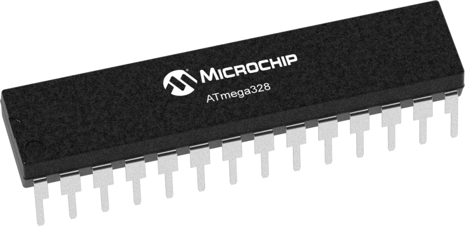

# Modelo

- Classificação: microcontrolador
- Nome técnico: Atmel ATmega 328

O ATmega 328 é utilizado para projetos que necessitam de um microcontrolador simples, especialmente nas placas de Arduino Uno.

## Características

### Arquitetura
A arquitetura utilizada é a Harvard.

### Conjunto de instruções
O conjunto de instuções é a RISC, com 131 instruções.

### CPU

- Clock: 16 MHz
- Cache:
- Núcleos: 1 núcleo

### GPU

Não possui GPU.

### Memória

| Memória 	| Tipo 	|
|-	|-	|
| Flash 	| 32 KB 	|
| EEPROM 	| 1 KB 	|
| SRAM 	| 2 KB 	|

### GPIO

- Quantidade: 23

### Recursos

- Seis canais PWM
- Contador em tempo real
- Seis modos de descanso.

## Fotos

## Referências

[Baú da Eletrônica](https://www.baudaeletronica.com.br/microcontrolador-atmega328p.html)

[Datasheet](https://storage.googleapis.com/baudaeletronicadatasheet/ATmega328P.pdf)
