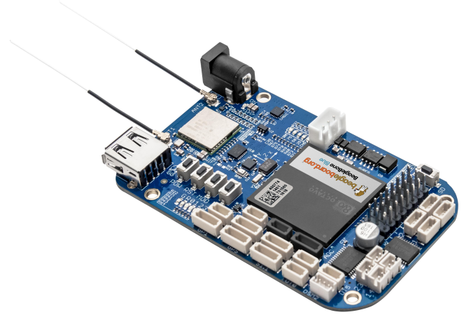

# Beaglebone Blue

- Classificação: Microcontrolador
- Nome técnico: Beaglebone Blue
- Ano de lançamento: 2017

Ideal para robótica e lidar com redes wifi.

## Características

### Arquitetura

- Não encontrado

### Conjunto de instruções

- RISC

### CPU

- Clock: 1GHz
- Cache: 32K L1 Icache + SED, 32K L1 Dcache + SED
- Núcleos: Dual Core

### GPU

Procurando pela compatibilidade com o processador, acredito que seja uma PowerVR, mas não encontrei um modelo específico.

- Clock:
- Cache:
- Núcleos:

### Memória

- Tipo: DD3 RAM
- Tamanho: 512MB

### GPIO

- Quantidade: 21
- Tipos: 3.3V

### Recursos

- Bluetooth: 4.1 e BLE
- Rede: Wifi (802.11bgn)

## Fotos

## Referências

[Google](http://google.com/)
