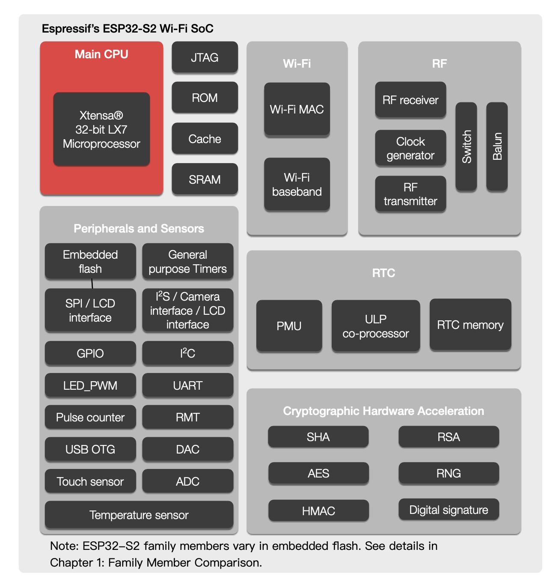
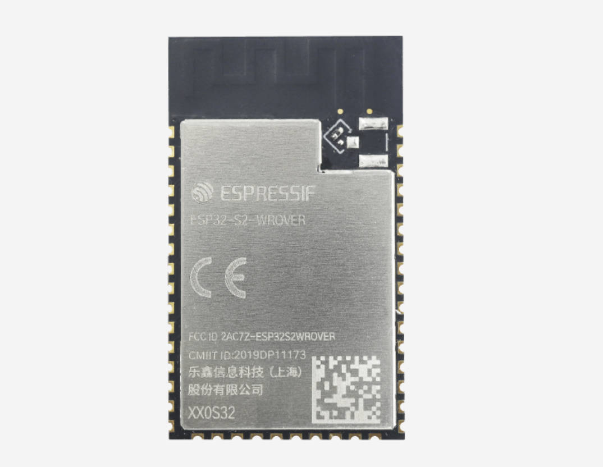
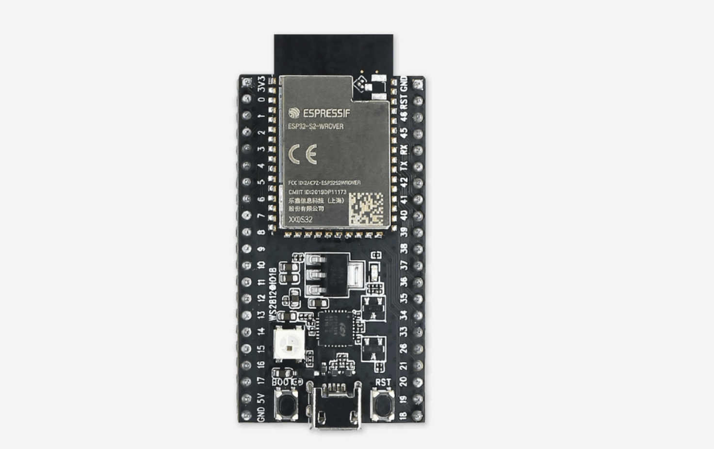

# ESP32-S2

- Classificação: Microcontrolador
- Nome técnico: ESP32-S2-WROOM
- Ano de lançamento: 2019

O ESP32-S2 é a evolução do microcontrolador ESP32. Seu principal avanço é a integração de uma interface USB e o fornecimento de 43 GPIOs. Em contrapartida essa nova versão do ESP32 não tem mais recursos como Bluetooth, Ethernet e CAN.

## Características

Por ser um microcontrolador com muitas possibilidades de comunicação (WIFI, GPIO, SPI, LCD, UART, I2C, I2S, interface de câmera, controle remoto de infravermelho, contador de pulsos, LED de modulação de largura de pulso, USB, ADC, DAC, sensor de touch, sensor de temperatura), ele serve para diversas aplicações de medição e automação.

Além disso o ESP32-S2 possui um processador de baixo consumo de energia (ULP - Ultra Low Power) que consome apenas 22 micro amperes com um ciclo de trabalho de 1%, o que favorece aplicações alimentados por baterieas que usam esporadicamente a maioria dos recursos do microcontrolador.

### Arquitetura

O microcontrolador possui uma arquitetura de Harvard com um espaço de memória para instruções de até 7,5 MB e um espaço de memória para dados de até 10,5 MB.

### Conjunto de instruções

O processador RISC Xtensa® LX7 do ESP32-S2 tem 80 instruções. O processador RISC do ULP tem apenas 32 instruções.

### CPU

- Clock: Até 240 MHz
- Cache: 8 KB de memória rápida que pode ser acessado diretamente pelo CPU
- Núcleos: 1 núcleo Xtensa® LX7 de 32-bits

### GPU

O ESP32 não possui uma GPU.

### Memória

- SRAM
  * Tipo: SRAM no Chip para dados e instruções
  * Tamanho: 320 KB

- ROM
  * Tipo: ROM para o Boot e para funções do núcleo
  * Tamanho: 128 KB

- Flash / RAM externo
  * Tipo: Flash ou RAM externo
  * Tamanho: Até 1 GB

### GPIO

- Quantidade: 43
- Tipos: Os GPIOs suportam funções múltiplas. Seguintes configurações são possíveis
  * Até 8 interfaces seriais
  * 1 interface de LCD serial de 8-bits de modo 8080 ou 6800
  * 1 interface de LCD paralelo de 8/16/24-bits de modo 8080 usando o recuso de I2C
  * 2 interfaces de UART (RS232, RS485, IrDA) até 5 Mbps
  * 2 interfaces de I2C
  * 1 interface de I2</S
  * 1 interface de camera de 8-bits ou 16-bits com um clock de até 40 MHz usando a interface I2S
  * 4 canais de controle remoto de infravermelho
  * 4 canais de contador de pulsos
  * 8 canais de LED PWM (Pulse Width Modulation - Modulação de Largura do Pulso)
  * 1 interface USB 1.1

### Recursos

- Bluetooth: Não possui Bluetooth
- Rede: 2.4 GHz WIFI

## Fotos

Foto do modulo ESP32-S2.

Foto da placa de desenvolvimento do ESP32-S2

## Referências

[Cadence, Xtensa LX7 Processor Datasheet, 2016](https://ip.cadence.com/uploads/1099/TIP_PB_Xtensa_lx7_FINAL-pdf)

[Espressif Systems, ESP32-S2 Family Datasheet, Version 1.1, 2020](https://www.espressif.com/sites/default/files/documentation/esp32-s2_datasheet_en.pdf)

[Espressif Systems, ESP32-S2-WROOM & ESP32-S2-WROOM-I Datasheet, Version 1.1, 2020](https://www.espressif.com/sites/default/files/documentation/esp32-s2-wroom_esp32-s2-wroom-i_datasheet_en.pdf)

[Espressif, ESP32-S2 ULP coprocessor instruction set, 2020](https://docs.espressif.com/projects/esp-idf/en/latest/esp32s2/api-guides/ulps2_instruction_set.html)
