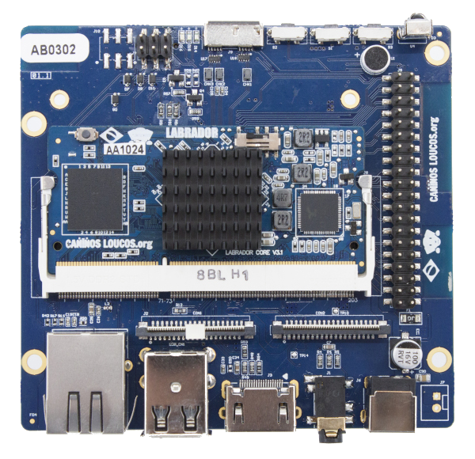

# Labrador 64 bits (Caninos loucos)

- Classificação: placa
- Nome técnico: Labrador 64 Bits: Core Board V3.0, Base Board M V2.0
- Ano de lançamento: Ainda não comercializada

A Labrador é um _Single Board Computer_, projetado e fabricado no Brasil pela
[Caninos Loucos](https://caninosloucos.org) -- uma iniciativa do
Laboratório de Sistemas Integráveis Tecnológico (LSI-TEC) em parceria com a
Escola Politécnica da Universidade de São Paulo (Poli-USP).

A labrador é constituída de duas placas: a "Labrador Core Board", responsável
por prover o poder de processamento e memoria; e a "Labrador Base Board", que
extende o suporte a periféricos, com uma variedade de diferentes conectores.

A placa da Caninos Loucos foi projetada para o universo de Internet das Coisas.
São diversas as aplicações possíveis para ela, como por exemplo:
_Edge Computing_, Visão Computacional e projetos de inteligência artificial.

## Características

### Arquitetura

64 bits (ARM).

### Conjunto de instruções

Armv8-A.

### CPU

- Modelo: ARM Cortex A53 (64-bits)
- Clock: 1,3 GHz
- Cache: 8KB-64KB L1 e 128KB-1MB L2 (expecificação da fabricante)
- Núcleos: 4

### GPU

- Modelo: ARM Mali 450 MP6 
- Clock: Não encontrado
- Cache: Não encontrado
- Núcleos: Não encontrado

### Memória

- Tipo: LPDDR3 SDRAM
- Tamanho: 2GB

### Armazenamento Interno

- Tipo: eMMC
- Tamanho: 16GB

### GPIO

40 pinos, 28 GPIOs (compatíveis com Raspberry PI / suportam UART, I2C, SPI\*,
PWM e I2S.)

### Sistema Operacional

Debian 10 Linux kernel 4.19.

### Recursos

#### Conexão sem fio

- Bluetooth LE 5.0
- Rede Wi-Fi 802.11 2.4GHz
- Ethernet 10/100Mbps (RJ45)
- Receptor Infravermelho (38kHz) \*
- Preparado para conectividade LoRaWAN \*

#### I/O (Memória, Áudio e Video)

- 1x slot para cartão MicroSD SD/SDHC/SDXC
- 2x USB2.0 (tipo A)
- 1x USB 3.0 OTG (micro-B) \*
- 1x HDMI 1.4 (tipo A), com resolução de até 1920×1080 à 60Hz
- 1x LVDS-DSI para LCDs, com resolução de até 1920×1080 à 60Hz
- 1x CVBS PAL/NTSC (PJ342 3,5mm)\*
- 1x saída estéreo analógica (PJ342 3,5mm)
- 1x entrada e saída I²S
- Microfone embutido
- 3x LEDs: vermelha, azul e verde

### Tamanho e Peso

Core Board:
- Dimensões: 67,6 x 31,0 mm
- Peso: 10,1g

Base Board:
- Dimensões: 92,7 x 88,0 mm
- Peso: 59,4g

\* Características não suportadas pela versão do sistema operacional que está
   atualmente disponível (Debian 10 Linux kernel 4.19).

## Fotos

## Referências

- [Página Oficial da Labrador 64 bits](https://caninosloucos.org/en/labrador-64-en/)
- [Especificacões do processador Cortex-A54](https://developer.arm.com/ip-products/processors/cortex-a/cortex-a53)
- [Página do LSI-TEC](https://www.lsitec.org.br/institucional)
- [Página da Caninos Loucos](https://caninosloucos.org/en/program-en/)
