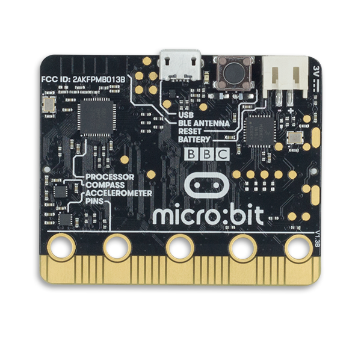

# Modelo (Micro:bit)

- Classificação: microprocessador
- Nome técnico: BBC micro:bit
- Ano de lançamento: 2015

O micro:bit é uma placa programável criada para ensinar programação para crianças. Possui sensores como acelerômetro, sensor de luz, de temperatura e bússola, possui um visor por meio de uma matriz 5x5 de leds, dois botões programáveis, além de comunicação via rádio e conectividade via USB e Bluetooth.

## Características

### Arquitetura

### Conjunto de instruções

### CPU

- Clock: 32-bit ARM Cortex M0
- Cache: 16KB
- Núcleos: 1

### GPU

- Clock: não se aplica
- Cache: não se aplica
- Núcleos: não se aplica

### Memória

- Tipo: RAM
- Tamanho: 16 KB de RAM

### GPIO

- Quantidade: 3 large IO rings e 19 GPIO
- Tipos: 
  19 pinos GPIO atribuídos
  2 são atribuídos à interface I2C on board
  6 são usados para exibição ou recurso de detecção de luz
  2 são usados para detecção de botão on board
  1 é reservado para uma interface de acessibilidade
  19 pode ser atribuído como entrada ou saída digital
  19 podem ser atribuídos a até 3 canais PWM simultâneos
  19 pode ser atribuído a 1 canal de transmissão serial e 1 canal de recepção serial
  6 podem ser atribuídos como pinos de entrada analógica
  3 pode ser atribuído a uma interface de comunicação SPI opcional
  3 podem ser atribuídos para até 3 entradas de detecção de toque simultâneas

### Recursos

- Bluetooth: sim
- Rede: não

## Fotos

## Referências

https://tech.microbit.org/hardware/

https://tech.microbit.org/hardware/#interface

https://pt.qwe.wiki/wiki/Micro_Bit 

https://pt.wikipedia.org/wiki/Micro_Bit

https://tecnologia.educacional.com.br/project/bbcmicrobit/

https://microbit.org/

https://makecode.microbit.org/

