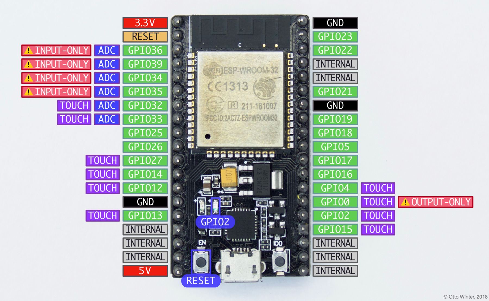

# NodeMCU ESP32

- Classificação: microcontrolador
- Nome técnico: nodemcu-32s
- Ano de lançamento: 2016

Esse dispositivo é um microcontrolador com Wi-Fi 802.11b/g/n e Bluetooth, implementando também o protocolo BLE (Bluetooth Low Energy). 

## Características

### Arquitetura

Microprocessador 32-bit LX6, com um co-processador "Ultra low power".

### Conjunto de instruções

Comandos AT para interface com os processadores principais e um conjunto de instruções RISC para o co-processador. Mais detalhes em [Conjunto de instruções AT] e em [Conjunto de instruções do co-processador].

### CPU

- Clock: 80-240MHz
- Cache: N/A
- Núcleos: 2 + co-processador ULP

### GPU

- Clock: N/A
- Cache: N/A
- Núcleos: N/A

### Memória

- Tipo: Flash
    - Tamanho: 4MB
- Tipo: RAM
    - Tamanho: 320KB

### GPIO

- Quantidade: 38
- Tipos: UART, GPIO, ADC, DAC, SDIO, SD card, PWM, I2C, I2S

### Recursos

- Rede: Wi-Fi 802.11b/g/n
- Bluetooth: v4.2 BR/EDR e BLE (antena compartilhada com o Wi-Fi)

## Fotos

## Referências

[PlatformIO]: https://docs.platformio.org/en/latest/boards/espressif32/nodemcu-3html#board-espressif32-nodemcu-32s
[PlatformIO]

[ESPHome]: https://esphome.io/devices/nodemcu_esp32.html
[ESPHome]

[Wikipédia]: https://en.wikipedia.org/wiki/ESP32
[Wikipédia]

[Ai-thinker (datasheet do fabricante)]: http://wiki.ai-thinker.com/_media/esp32/docs/nodemcu-32s_product_specification.pdf
[Ai-thinker (datasheet do fabricante)]

[Conjunto de instruções AT]: https://www.espressif.com/sites/default/files/documentatiesp32_at_instruction_set_and_examples_en.pdf
[Conjunto de instruções AT]

[Conjunto de instruções do co-processador]: https://docs.espressif.com/projects/esp-idf/en/latest/esp32/api-guidulp_instruction_set.html
[Conjunto de instruções do co-processador]
