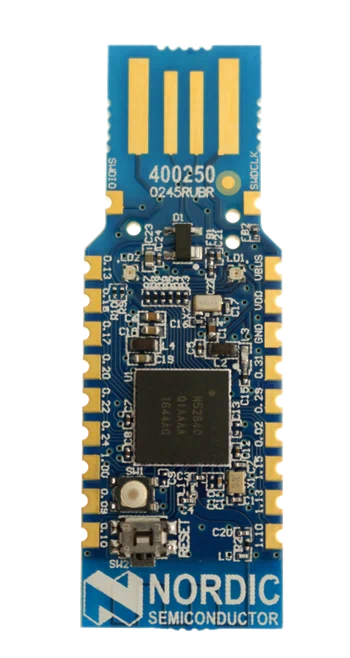

# Nordic Semi nRF52840

- Classificação: Microcontrolador
- Nome técnico: nRF52840
- Ano de lançamento: 2018

Este SoC é considerado uma boa alternativa ao conhecido ESP32 quando não há necessidade de WiFi.
Tem opções muito superiores em comunicação Bluetooth e similares (ANT+, Bluetooth LE, 802.15.4, Thread, Zigbee, 2.4Ghz proprietário), além de NFC.
Sua documentação e kit de desenvolvimento (SDK) são considerados superiores aos do ESP32, porém há menos suporte de comunidade e firmwares alternativos.
Seu consumo de energia é muito menor ao do ESP32 e sus opções de deep-sleep são muito mais sofisticadas e fáceis de usar.
Tem uma CPU mais lenta comparado ao ESP32, mas sua arquitetura mais sofisticada, presença de FPU e co-processador de criptografia o torna mais rápido em diversas tarefas.
Possui muito mais opções de conectividade, tais como USB, comparadores analógicos, ADCs de alta resolução, etc.

## Características

### Arquitetura

CPU baseada em um núcleo ARM Cortex-M4. Inclui um co-processador de criptografia ARM TrustZone.

### Conjunto de instruções

A CPU Cortex-M4 é de 32 bits e baseada em um conjunto de instruções RISC. Inclui também uma unidade de ponto flutuante auxiliar (FPU).

### CPU

- Clock: 64 MHz
- Cache: Apenas para acesso ao flash
- Núcleos: 1

### GPU

- Não possui

### Memória

- Tipo: 256 KB
- Tamanho: SRAM

### GPIO

- Quantidade: 48
- USB 2.0 full speed (12 Mbps)
- QSPI 32 MHz e SPI 32MHz
- ADC 12-bit, 200 ksps com 8 canais
- Comparador de 64 níveis e comparador deep-sleep de 15 níveis
- Sensor de temperatura
- 4x 4-channel pulse width modulator (PWM)
- Interfaces I2S e PDM
- 5x timers 32-bit
- 2x interfaces I2C
- 2x interfaces UART
- 3x real-time counter (RTC)

### Recursos

- Bluetooth LE
- Bluetooth mesh
- ANT+
- 802.15.4
- NFC
- Thread
- Zigbee
- 2.4Ghz proprietário

## Fotos

## Referências

[Página Oficial](https://www.nordicsemi.com/Products/Low-power-short-range-wireless/nRF52840)
[Datasheet](https://infocenter.nordicsemi.com/pdf/nRF52840_PS_v1.1.pdf)
