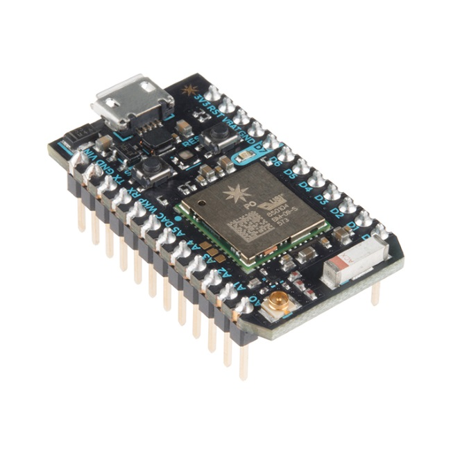
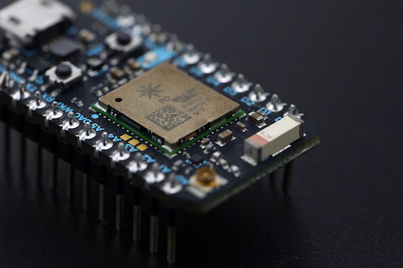

# Particle Photon

- Classificação: Placa - kit de desenvolvimento para IoT
- Nome técnico: PHOTONH, PHOTONNOH
- Ano de lançamento:

O Particle Photon é uma placa com foco no desenvolvimento de dispositivos de Internet das Coisas baseados em Wi-Fi.

## Características

A placa possui um processador de baixo consumo de energia e uma placa de rede integrada ao circuito, a qual permite o
acesso aos padrões 802.11 b/g/n. É programada em C++ com convenções idênticas às de Arduíno, o que garante uma fácil
portabilidade de códigos escritos para Arduíno.

O circuito tem seu desenvolvimento baseado na nuvem, podendo ser acessado remotamente, permitindo uma alta flexibilidade
e frequentes atualizações via Web.

O seu desenvolvimento é totalmente voltado para ambientes com Wi-Fi, oferecendo uma capacidade de processamento muito
mais alta que o Arduíno, porém não possui nenhuma outra porta de conexão além dos pinos GPIO e a entrada micro-USB de
energia.

Pode ser utilizado para automação residencial, controle de parâmetros do ambiente, automação e inspeção industrial, etc.

Possui um custo de cerca de US$ 19,00.

### Arquitetura

Possui o micro controlador STM32 ARM Cortex M3, o qual faz parte da família STM32 produzidos pela STMicroelectronics. Sua
arquitetura é ARMv7-M, com um pipeline de três estágios e branch predictor, latência de interrupção de 12 ciclos e
consumo de 0,19 mW/MHz.

Este possui internamente um processador ARM de 32 bits, uma memória RAM estática, memória flash e interface de
depuração. Este micro controlador é voltado para o baixo consumo de energia

### Conjunto de instruções

O conjunto de instruções deste micro controlador é relativamente pequeno, baseado em uma arquitetura RISC ARM. Suas
instruções são focadas em operações aritméticas e variantes, bem como manipulação simples de bits e requisições para a
memória.

Segundo seu datasheet, seu conjunto de instruções é Armv7-M, Thumb e Thumb-2.

### CPU

Sua CPU é a Cortex-M3, sendo da família de núcleos de processadores RISC de 32-bits licenciados pela ARM Holdings.

- Clock: 120 MHz máx.
- Cache: Não possui
- Núcleos: 1

### GPU

Não possui

### Memória

- Tipo: Flash e RAM
- Tamanho: 1MB e 128 RAM

### GPIO

- Quantidade: 18 portas
- Tipos: sinal mixado e periféricos avançados

### Recursos

- Bluetooth: Não possui
- Rede: Broadcom BCM43362 Wi-Fi chip com suporte para os padrões 802.11b/g/n.

## Fotos

## Referências

1. https://docs.particle.io/datasheets/wi-fi/photon-datasheet/
2. https://www.st.com/en/microcontrollers-microprocessors/stm32-32-bit-arm-cortex-mcus.html
3.
https://www.st.com/resource/en/programming_manual/cd00228163-stm32f10xxx-20xxx-21xxx-l1xxxx-cortex-m3-programming-manual-stmicroelectronics.pdf
4. https://developer.arm.com/ip-products/processors/cortex-m/cortex-m3
