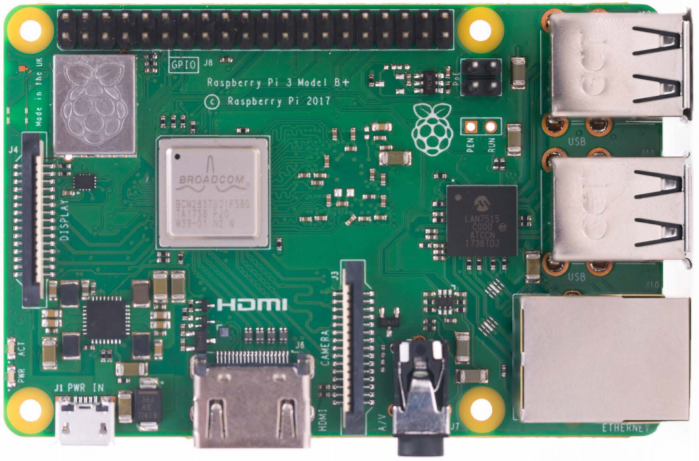

# Raspberry Pi 3 Model B+

- Classificação: single board computer
- Nome técnico: Raspberry Pi 3 Model B+
- Ano de lançamento: 2018

É um computador de placa única, é muito bom para fazer processamentos mais complexos. Pode também serem conectados diversos sensores. Tem conexão à internet integrada e bluetooth.

## Características
Power supply: 5V/2.5A DC via micro USB connector

Características adicionais:
- Wifi, Ethernet e bluetooth.
- 4 USB 2.0 ports.
- 40-pin GPIO Header.s
- HDMI.
- Display and Camera port.
- SD card port.

Operating temperature, 0–50°C 

### Arquitetura
32-bit

### Conjunto de instruções
RISC

### CPU

- Clock: 1.4GHz.
- Cache: Não tem.
- Núcleos: quad core.

### GPU
Não tem.

### Memória

- Tipo: SDRAM
- Tamanho: 1GB

### GPIO

- Quantidade: 40-pin GPIO header extendido
- Tipos: Digital Bidirecional

### Recursos

- Bluetooth: Bluetooth 4.2
- Rede: 2.4GHz and 5GHz IEEE 802.11.b/g/n/ac wireless LAN, Gigabit Ethernet over USB 2.0 (maximum throughput 300Mbps) 

## Fotos

## Referências

[Raspberry Pi 3 Model B+ Product Brief](https://static.raspberrypi.org/files/product-briefs/200206+Raspberry+Pi+3+Model+B+plus+Product+Brief+PRINT&DIGITAL.pdf)