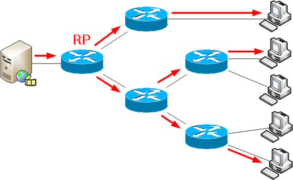

# Modelo (IR, NFC, TCP, Multicast, CoAP)

- Classificação: Tecnologia, Protocolo
- Concepção: 1998
- Lançamento: 2012

Descrição: Permite uma comunicação entre x, y, z e é útil para trocar dados nas condições a, b, c.

## Características

### Tecnologia

- Alcance
- Velocidade
- Protocolos

### Protocolo

- RFC, IEEE, ABNT
- Tecnologias que usam

### Exemplo de uso

## Referências

[RFC1112 - Host Extensions for IP Multicasting](https://tools.ietf.org/html/rfc1112)

[RFC3171 - IANA Guidelines for IPv4 Multicast Address Assignments](https://tools.ietf.org/html/rfc3171)
